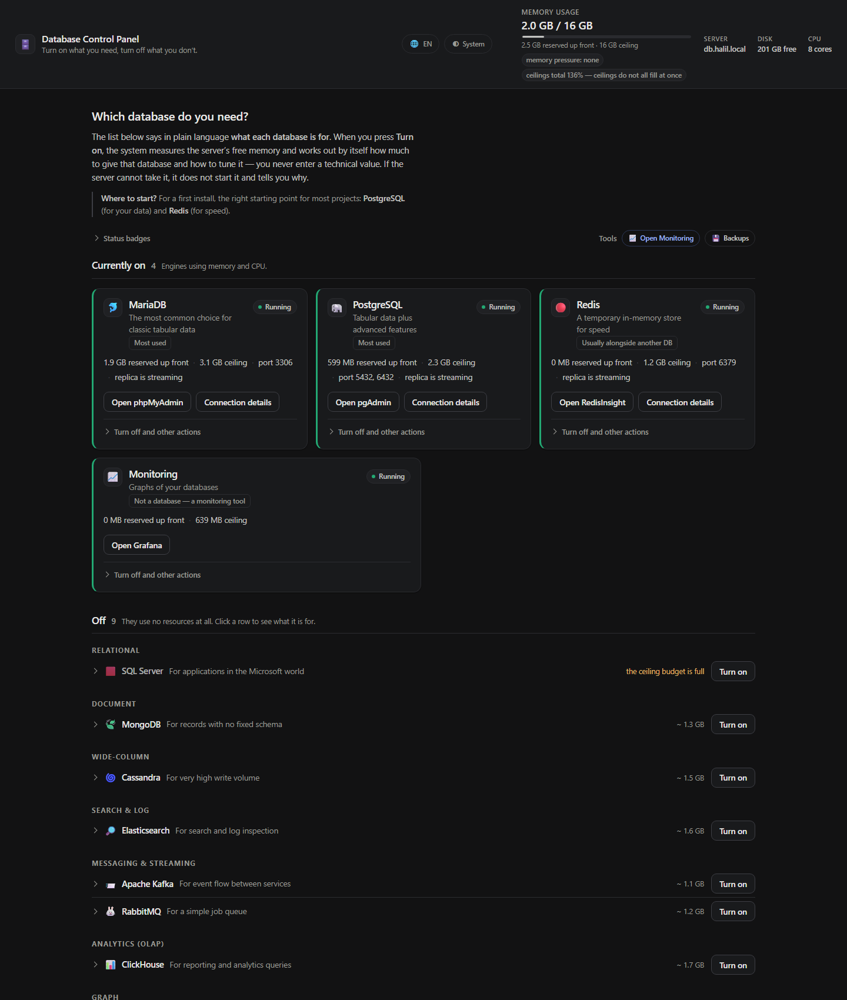
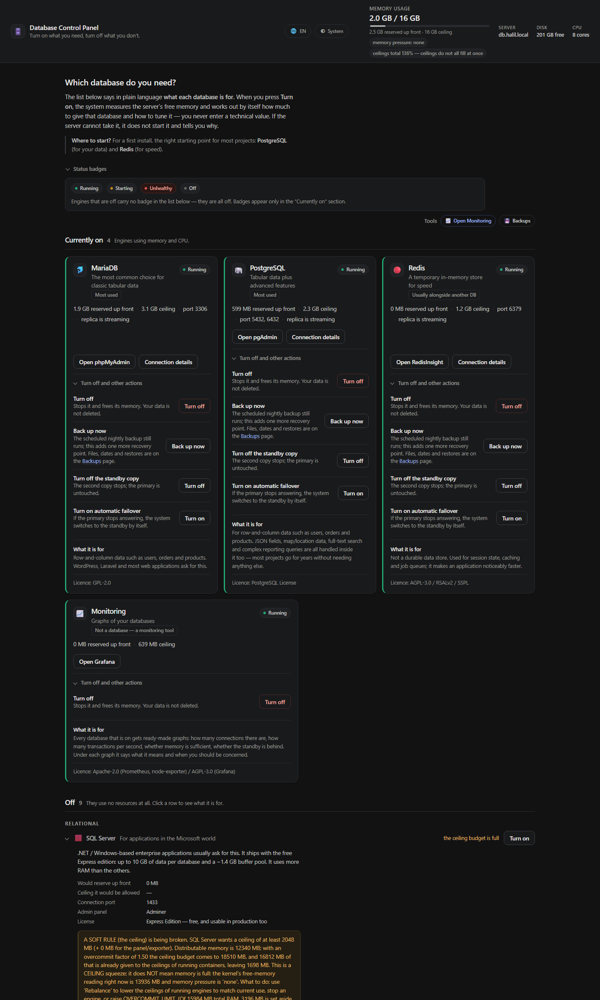
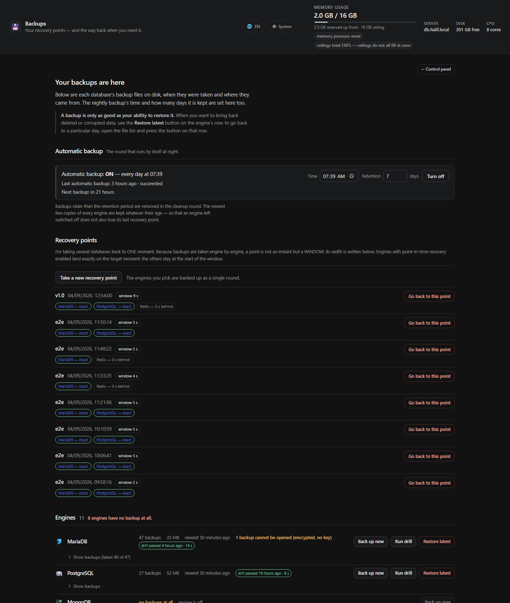
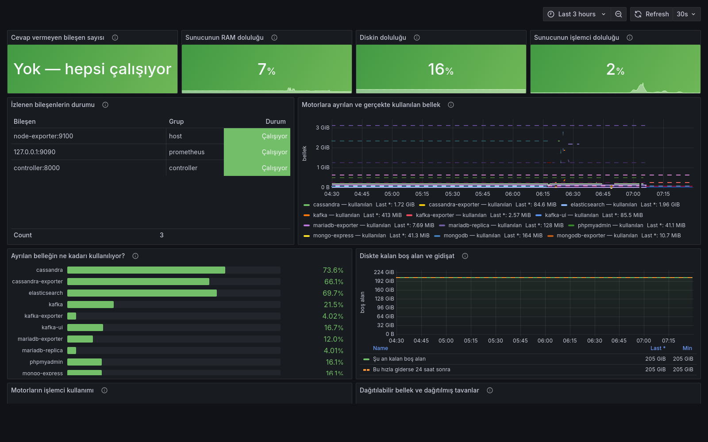
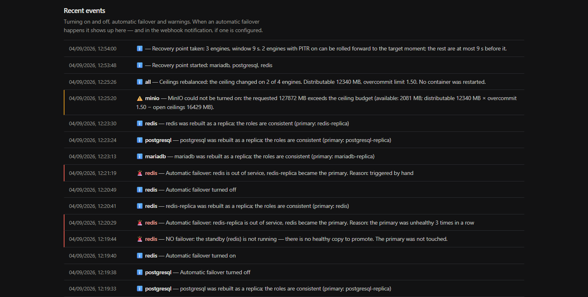
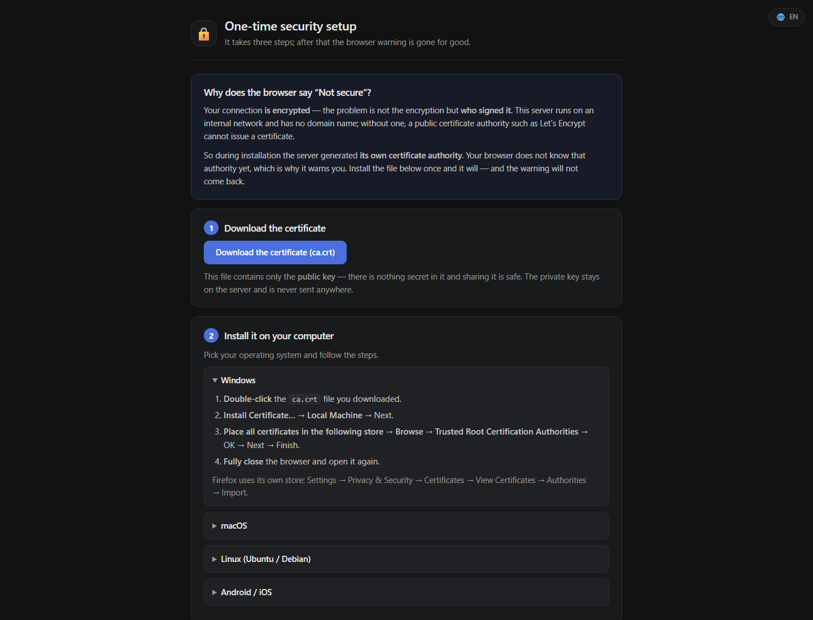

<div align="center">

# 🗄️ databases-stack

*[Türkçe](README.tr.md) · **English***

### *12 databases on one server — turn on what you want, turn off what you don't*

**Press a button in the panel and your database comes up.** The system measures
the server's memory and works out by itself how much to give that database and
what its internal settings should be. You enter no technical values at all.

**If the primary goes down it fails over to the replica by itself** — without
your application's connection address changing.

[](https://docs.docker.com/compose/)
[](docs/KUBERNETES.md)
[](LICENSE)

</div>

---

## What does it look like?

<div align="center">

</div>

The page has two zones. At the top, the ones that are **currently on**, as
cards: how much memory they took, which port to connect to, whether they have a
replica and automatic failover. At the bottom, the **off** ones as single rows —
they consume nothing, they don't deserve a card. Click a row and what it is for,
its estimated memory and its license open up.

The primary number in the top bar is **actual usage**; the line under it holds
two separate quantities: *reserved up front* (the memory the engine really takes
at startup) and *upper limit* (the docker limit). Separating the two is
essential, because the docker limit is a **ceiling, not a reservation** — adding
up ceilings and comparing them with RAM is like adding up the top speeds of the
cars on a road and declaring "road capacity exceeded". A measured example: on a
16 GB server the ceiling total showed 14 GB while actual usage was 2 GB, and the
kernel's memory pressure was zero.
Details: [Memory is calculated automatically](#memory-is-calculated-automatically).

<div align="center">

</div>

Everyday actions are on the face of the card (open the panel, connection info).
**The hard-to-undo ones** — turning it off, removing the replica, turning off
automatic failover — sit in a collapsed section and each one says **in a single
sentence what will happen**. Hitting the wrong one out of six buttons standing
side by side is not possible in this product.

<div align="center">

</div>

Backups have their own page (**Tools ("Araçlar") → Backups ("Yedekler")**): the
time of the nightly round and how many days files are kept, how many backups
each engine has, when the newest one was taken, and every file's **source** —
`elle`, `zamanlı` or `dış` (command line). (`elle` = manual, `zamanlı` =
scheduled, `dış` = external.) Recovery is here too: **Restore latest backup
("Son yedeğe dön")**, or a particular day from the file list. Because a restore
deletes the data and puts something else in its place, the confirmation dialog
makes you type the engine name — this is not a one-click job.

Each engine's row also carries a **drill badge**: `prova geçti 17 dakika önce ·
10 sn` (drill passed 17 minutes ago · 10 s). That means this backup really was
restored in a single-use container, and this is how many seconds it took — a
measurement, not a promise. Whether you run the drill from the panel, from the
weekly scheduler or from the command line makes no difference: the result lands
in the same ledger, **with its source written down**.

<div align="center">

</div>

Monitoring is not a separate installation, it is a module you turn on from the
panel: say **Enable monitoring ("İzleme aç")** and Prometheus + Grafana come up,
the exporter of every running engine is added to the target list by itself, and
**11 ready-made dashboards** arrive — all of them in Turkish and written to
answer the question "is everything fine?". You do not need to write a single
PromQL query; and when you turn it off, it drops out of the target list by
itself.

<div align="center">

</div>

At the bottom of the panel **it says what happened**: which engine came up when,
how much memory was allocated, which setting was calculated, why an activation
was refused, when automatic failover ran and **for what reason**. You follow
what is going on from here, without logging into the server and reading
`docker logs`.

<div align="center">

</div>

There is no domain name on an internal network, so the server produces the TLS
certificate itself. To get rid of the browser's "not secure" warning, this
**one-time** guide walks you through it step by step — once you install the
certificate the page moves you on to the panel automatically. Once you are in
the panel, every management screen (phpMyAdmin, pgAdmin, Grafana…) opens without
asking for a password; someone arriving directly from outside still meets the
password screen.

---

## Installation

**Prerequisite:** Docker (if you don't have it, `install.sh` gives you the
install command):

```bash
curl -fsSL https://get.docker.com | sudo sh && sudo usermod -aG docker $USER && newgrp docker
```

Then:

```bash
sudo mkdir -p /opt/databases && sudo chown $USER:$USER /opt/databases
git clone https://github.com/halilibrahimd27/databases-stack.git /opt/databases
cd /opt/databases && ./install.sh
```

That's all. It asks nothing. It generates/detects the passwords, the TLS
certificates and the server address itself, and writes the results to the screen
and to `credentials.txt`.

Then go to `https://<sunucu-ip>/` in your browser and press the **Activate
("Aktif Et")** button on the row of the database you need.

> **If the browser says "not secure":** download the certificate from
> `http://<sunucu-ip>/ca.crt` and install it on your computer; the warning goes
> away. This is a certificate authority private to the internal network — it
> needs no domain name and never goes out to the internet.

---

## How does it work?

After installation **no database is running.** Only three small services are up:
the front door (nginx), the controller and Adminer. ~450 MB in total.

When you turn a database on in the panel, this is what happens behind the
scenes:

```
"Aktif Et"  →  The controller measures the server
                 ├─ Total RAM, the kernel's MemAvailable, free disk, CPU
                 ├─ The RESERVE of running engines (what they really take at startup)
                 ├─ The CEILING of running containers (docker --memory)
                 └─ /proc/pressure/memory — is the kernel under pressure?
                             ↓
               Do all three gates pass?
                 ├─ NO  → does not start it, says WHICH gate it hit
                 └─ YES → calculates the ceiling and the engine's internal settings
                             (buffer pool, JVM heap, WiredTiger cache,
                              max_connections, work_mem …)
                             ↓
               docker compose --profile <motor> up -d
```

**A database that is off creates no container at all** — zero RAM, zero CPU.
Turning it off does not delete the data; it stays on disk, and when you turn it
back on everything is where you left it.

### Memory is calculated automatically

Memory has two separate quantities, and this product's most expensive mistake
was taking them for the same thing.

| | **Reserve** (floor) | **Ceiling** (limit) |
|---|---|---|
| What is it? | The memory the engine **really allocates at startup** | `docker --memory`: if it is exceeded the kernel kills the container (OOM) |
| Where does it come from? | PostgreSQL `shared_buffers`, MariaDB `innodb_buffer_pool_size`, `-Xms` on JVM engines | The upper limit the controller gives the engine |
| Redis · MSSQL · MinIO · ClickHouse | **~0** — they start empty and *grow* toward the ceiling | The last point they can grow to |
| Their total | Can **never** exceed allocatable memory | **May** exceed allocatable (default limit: 1.5×) |

**Allocatable memory** = total RAM − the operating system's share − the core
services' share.

#### It is normal for the ceiling total to exceed RAM

Measured on a 16 GB test server:

| Container | Ceiling | Actual usage |
|---|---|---|
| mariadb | 3196 MB | 243 MB (7%) |
| mariadb-replica | 3196 MB | 213 MB (6%) |
| postgresql | 2397 MB | 98 MB (4%) |
| redis | 1278 MB | 5 MB (0%) |

On the same machine total RAM is 15984 MB, the ceilings add up to 15087 MB, and
allocatable memory is 12340 MB (15984 − 3196 operating system − 448 core
services). So the ceiling total is **122% of allocatable**. Against that:

- `free -m` → used **1508 MB**, available **13987 MB** (the machine is 91% free),
- `/proc/pressure/memory` → `some avg10=0.00 · avg60=0.00`, `full avg10=0.00`
  (the kernel is not stalling even one task for memory),
- the total the engines **really allocated**: **2516 MB** — 20% of allocatable.

Adding up ceilings and comparing them with RAM is like adding up the top speeds
of the cars on a road and declaring "road capacity exceeded". The product did
exactly this for a while: the panel said **"AYRILAN BELLEK 15 GB / 12 GB · %122
aşım"** (allocated memory 15 GB / 12 GB · 122% over) and told you "not enough
memory" on every engine that was off — on an idle machine.

#### The three gates before an engine starts

1. **The reserve gate — hard.** `Σ reserve + the new engine's reserve ≤
   allocatable`. It is never bent: the reserve is the **real** memory the engine
   will allocate; starting it when it does not fit is an invitation to OOM.
   A request that does not fit is shrunk first (smaller ceiling → smaller
   reserve); if it does not fit even at the minimum ceiling, it is refused.
2. **The ceiling gate — soft.** `Σ ceiling + the new ceiling ≤ allocatable ×
   1.5`. The ceilings do not all fill up at the same time. The coefficient
   changes with the controller's `OVERCOMMIT_LIMIT` environment variable;
   writing `1.0` turns overcommit off, i.e. goes back to the old behaviour
   above.
3. **The kernel seatbelt.** Does `MemAvailable` in `/proc/meminfo` cover the new
   reserve plus the safety margin; is `/proc/pressure/memory` reporting
   pressure? **Whatever the ledger says, the kernel's reality is binding.** On
   old kernels without PSI the pressure gate is skipped — refusing to start an
   engine on the grounds of something we could not measure would be lying to the
   user.

A refused activation writes down **which gate** it hit; it does not say "not
enough memory" to all of them at once.

#### Rebalancing

When the ceiling total passes the policy limit (an engine was enlarged by hand,
RAM was removed from the server, or `OVERCOMMIT_LIMIT` was lowered) the
controller reports it. **Rebalancing** — from the panel or `POST /api/rebalance`
— recalculates the ceilings of the running engines and applies them **live**
with `docker update`:

- The containers are **not restarted.** Open connections are not dropped, InnoDB
  recovery does not run, there is no downtime. (The easy way would have been to
  recreate the engine with `compose up -d`; that way shuts down a running
  database.)
- Only the **ceiling** changes. The memory an engine allocated at startup cannot
  be shrunk while it runs — you cannot give the buffer pool back. That is why
  rebalancing never takes a ceiling **below the engine's current reserve**; that
  setting is only recalculated against the new ceiling when the engine is
  restarted.

`./scripts/e2e/sizing.sh` measures this: it creates the overcommit condition
itself, calls rebalancing, reads from the cgroup that the ceiling really
dropped, and verifies with `.State.StartedAt` that no container was restarted.

Details, formulas and the per-engine reserve table:
[docs/BELLEK.md](docs/BELLEK.md)

### Why this matters

What the same arithmetic looks like in practice — `./stack.sh plan` output on an
idle server:

| Server | If MariaDB starts | If Elasticsearch starts |
|---|---|---|
| 512 MB | **does not start** — 512 MB ceiling + 320 MB panel/exporter does not fit into allocatable | does not start |
| 2 GB | ceiling 512 MB · reserve (buffer pool) 307 MB | does not start |
| 4 GB | ceiling 819 MB · reserve 491 MB | ceiling 1024 MB · reserve (JVM heap) 512 MB |
| 16 GB | ceiling 3276 MB · reserve 1965 MB | ceiling 2949 MB · reserve 1474 MB |
| 128 GB | ceiling 16 GB (so a single engine does not swallow the server) · reserve 9830 MB | ceiling 16 GB · reserve 8192 MB |

A 4 GB machine does not try to start a 16 GB database; a 128 GB machine does not
stay on the default values either. If one of the gates is closed the card goes
inactive and writes down **which gate** it was. A refusal at the ceiling gate
says this to the user who sees free memory on the screen and rightly objects
"but there is room": *"This is a CEILING squeeze, it does NOT mean memory is
full"* — and then lists the kernel's free-memory measurement at that moment, the
pressure level, and the ways out (rebalance / stop an engine / raise
`OVERCOMMIT_LIMIT`).

To see the arithmetic: `./stack.sh plan mongodb`

---

## The databases inside

They all arrive turned off; only the ones you use are started.

| | Database | What for | Panel |
|---|---|---|---|
| 🐬 | **MariaDB** | Classic tabular data — users, orders, products | phpMyAdmin |
| 🐘 | **PostgreSQL** | The same job + JSON, geo data, complex queries | pgAdmin |
| 🍃 | **MongoDB** | Records with no fixed schema | Mongo Express |
| 🔴 | **Redis** | Cache, session, queue (not durable storage) | RedisInsight |
| 🟥 | **SQL Server** | .NET / Windows based corporate applications | Adminer |
| 🌀 | **Cassandra** | Very high write volume, linear scale | cqlsh |
| 🔎 | **Elasticsearch** | On-site search, log analysis | Kibana |
| 📨 | **Kafka** | Event streaming between services | Kafka UI |
| 🐰 | **RabbitMQ** | Simple job queue (much easier than Kafka) | Management UI |
| 📊 | **ClickHouse** | Reporting and analytics queries (OLAP) | Play UI |
| 🕸️ | **Neo4j** | Relationship-heavy data, recommendation engines | Neo4j Browser |
| 🪣 | **MinIO** | File/image storage (S3 compatible) | MinIO Console |

> If you don't know what to pick: **PostgreSQL** (for your data) +
> **Redis** (for speed) is the right start for most projects.

---

## Access

There is a single front door; **no panel's port is opened directly to the
outside.** They all pass behind TLS + a password.

| Address | What |
|---|---|
| `https://<sunucu>/` | Management panel |
| `https://<sunucu>/yedekler` | Backups and restore |
| `https://<sunucu>:8081…8091` | Database panels (an "inactive" page if the engine is off) |
| `https://<sunucu>:9443/metrics/<motor>` | Prometheus metrics |
| `<sunucu>:3306, 5432, 27017 …` | The database ports your application connects to |

The database ports go through the gateway too. That gives two things: your
connection address does not change during a failover, and containers do not open
ports directly on the host.

You can copy the connection info from the panel with the **Connection info
("Bağlantı bilgisi")** button, or with `./stack.sh conn postgresql`.

---

## From the terminal

Does everything the panel does; the same automatic sizing runs.

```bash
./stack.sh list                  # engines, their states, estimated memory
./stack.sh enable postgresql     # turn on
./stack.sh plan elasticsearch    # how much would be allocated if it started?
./stack.sh disable redis         # turn off (data is not deleted)
./stack.sh conn mariadb          # connection info
./stack.sh replica on postgresql # set up a replica
./stack.sh backup                # back up every running engine
./stack.sh app-user              # restricted user for the application
./stack.sh doctor                # installation health check
```

---

## Backups

It has **its own page** in the panel: `https://<sunucu>/yedekler`. You open it
from the *Backups ("Yedekler")* link in the **Tools ("Araçlar")** row at the top
of the panel; you come back with **← Management panel ("← Yönetim paneli")** at
the top of the page. It is behind the same password, the same door — whatever
the panel is, this is too.

The reason it is a separate page is this: the backup list is a list that grows
file by file, per engine. Squeezed under the management panel, the answer to
"was a backup taken last night?" ended up under twelve cards, in the part of the
page you cannot see.

### The restore drill — the only honest assurance a backup has

A backup looking intact does not mean it can be restored. This product closes
that gap: the **drill really restores** the backup in a single-use container and
a single-use volume, measures how long it takes, counts tables/rows and compares
them with production. Then it deletes itself.

```bash
./scripts/restore-drill.sh mariadb        # drill with the newest backup
```

It does not touch production, the production volume or the gateway — and that is
not a statement of intent: the drill container is started with `--network none`
and a separate volume.

A measured run:

```
[✓] Geri yükleme tamamlandı — ölçülen RTO: 13 sn
    geri yüklenen kopya: 1 tablo / 1 satır
    üretim (mariadb-replica): 1 tablo / 1 satır
{"engine":"mariadb","ok":true,"seconds":13,"match":true,"cleanup":true, …}
```

(Restore complete — measured RTO: 13 s; restored copy: 1 table / 1 row;
production (mariadb-replica): 1 table / 1 row.)

On the *Backups* page in the panel, one of three states shows up on the engine's
row:

| Badge | What it means |
|---|---|
| `prova geçti 2 saat önce · 13 sn` | Drill passed 2 hours ago: this backup really was restored, and this is the measured time |
| `PROVA KALDI` | The drill failed — you are holding a backup that **cannot be restored**, and you learned it before the day of the disaster |
| `prova yapılmadı` | No drill has been run: you have a backup, but whether it can be restored is **unknown** |

The third one is shown deliberately: leaving something we do not know silently
blank makes you feel an assurance that does not exist. It runs by itself once a
week after the nightly backup (`DRILL_EVERY_DAYS`); if it fails, the event is
recorded at **critical** level and goes to the webhook.

### Importing — bringing in the data you already have

Starting a new database is easy; the real problem is that the data is already
somewhere else. `import.sh` brings in a dump file or a live remote source — and
**refuses to do the wrong thing**:

```bash
./scripts/import.sh mariadb dump.sql.gz              # local file
./scripts/import.sh postgresql --kaynak postgres://…  # live remote source
./scripts/import.sh mariadb dump.sql.gz --kuru        # show what would happen, write nothing
```

(`--kaynak` = source, `--kuru` = dry.)

| Situation | Behaviour |
|---|---|
| Target is not empty | **Refuses** and says what it found ("1 şema, 1 tablo, 16 KB" — 1 schema, 1 table, 16 KB) |
| `--uzerine-yaz` was given | Takes a **safety backup** first, and writes down the file name (`--uzerine-yaz` = overwrite) |
| The file is another engine's dump | **Refuses** — it recognises the format and writes down the right command |
| The engine is off | **Refuses**, and says how to start it |

Supported formats: MariaDB/MySQL `.sql(.gz)`, PostgreSQL `.sql(.gz)` and the
`-Fc` archive, MongoDB `.archive(.gz)`, Redis `.rdb(.gz)`, SQL Server `.bak`.

### Automatic backups

The daily backup time and the retention period are set from this page; turning
it on and off is one button. The scheduler runs **inside the controller** — it
needs no root privileges on the host, no cron installation, no systemd unit. The
result of the last run (when, if it succeeded; **together with the reason**, if
it failed) and the time of the next one are written in the same place.

> This is the result of a measured failure. Previously `install.sh` only
> *produced* the `state/crontab` file and said "to install it, `crontab
> state/crontab`". Nobody did it: on the test server `crontab -l | grep backup`
> returned zero lines, and the folders under `backups/` were empty. So while
> everyone assumed backups were being taken, none were — the worst outcome a
> backup system can produce. `./stack.sh doctor` now says so explicitly when
> scheduling is off.

Backups older than the retention period are deleted in the cleanup pass, but
**the newest few copies of every engine are kept no matter how old they are**:
the backup of an engine that stayed off is never refreshed, so it crosses the
date threshold — and the old version deleted its last recovery point along with
it.

### Manual backups

Every engine row has a **Back up ("Yedek al")** button (the same one sits on the
cards in the management panel too). A manual backup does not cancel the nightly
round, it creates an extra recovery point. The button is not clickable while the
engine is off: the dump tools connect to the database, and they have nothing to
do on an engine that is off.

The list writes down every file's date, size and **source**: `elle`, `zamanlı`
or `dış` (the host's cron or the command line). The source is not guessed from
the file name — the controller writes the files created after a run it started
itself into the ledger, and a file that never entered the ledger is `dış`.

### Restore

**This can now be done from the panel.** The **Restore latest backup ("Son
yedeğe dön")** button on the engine's row goes back to the newest copy; to go
back to a particular day you open the file list with **Show backups ("Yedekleri
göster")** and use the **Restore this backup ("Bu yedeğe dön")** button on that
row. The "latest backup" is not always the backup you want — if the operation
that corrupted the data happened yesterday at noon, the place to go back to is
the copy before it.

The button does not start the job right away. The confirmation dialog that opens
writes down what will happen — *the current data is deleted, the database goes
back to its state in that file, everything written after that date is lost* —
and shows the name, date, age and size of the file you are going back to. To
continue you have to **type the engine's name by hand**; the **Restore ("Geri
Yükle")** button stays disabled until it is typed correctly. This is the panel's
counterpart of the confirmation you give by typing `evet` ("yes") in the
terminal: not an operation that can be performed by hitting the wrong one of
several buttons standing side by side.

The file is verified **before** the data is touched. A restore started with a
corrupt or half-written backup does not bring the data back, it only destroys
it.

Automatic restore exists on five engines: **MariaDB, PostgreSQL, MongoDB, Redis,
SQL Server.** The others are backed up, but going back is a manual,
engine-specific operation; what to do for which is written in
[docs/BACKUP.md](docs/BACKUP.md).

### From the command line

The same thing the panel does; both call the same `scripts/backup.sh`.

```bash
./stack.sh backup                # running engines (the ones that are off are skipped)
./stack.sh backup mariadb        # a single engine
./scripts/backup.sh list         # list the backups
./stack.sh restore mariadb backups/mariadb/full/mariadb_full_20260901.sql.gz
```

> **If you run it from cron, watch the permissions.** Two separate identities
> write under `state/` and `logs/`: the controller as **root** inside the
> container (it has to reach the docker socket), and you and cron as the
> administrator on the server. Whoever writes first owns the file; the
> administrator cannot write again to a `0644/root:root` file that root created.
> The result is **silent**: the night jobs fail with "Kilit dosyası açılamadı"
> ("could not open the lock file"), and because the panel keeps working over its
> own path, no error is visible. The installation solves this by making `state/`
> and `logs/` setgid (2775) and with `umask 0002`. On an older installation:
>
> ```bash
> ./stack.sh doctor            # lists the files you cannot write, with their owner
> sudo ./stack.sh doctor --duzelt
> ```
>
> `doctor` looks not at the file's **mode** but at whether it is really
> writable — the mode can look right while the group membership is missing, and
> you still cannot write.

If you prefer the host's cron, `state/crontab` is still produced; if the two run
together, `backup.sh` prevents the collision with its own lock. The same lock is
held during a restore too — so that the 02:00 round does not dump a
half-restored database as a "valid backup" and sync it to the remote.

Details and per-engine methods: [docs/BACKUP.md](docs/BACKUP.md).
Remote storage (Google Drive / S3 / SFTP):
[docs/GOOGLE-DRIVE.md](docs/GOOGLE-DRIVE.md).

---

## A restore you can actually press

The weakest link in the backup family was always the same: **nobody presses
the restore button.** Pressing it meant four things — the current data is
destroyed, the outage lasts as long as the whole restore, whether the file
will really open is unknown until you press, and if you picked the wrong file
there is no way back.

In this version a restore is a **two-way door**:

| | Classic | Without downtime (shadow) |
|---|---|---|
| Production | **down** for the whole restore | **keeps running** |
| Outage | as long as the restore | the container recreate |
| Measured | — | restore 35 s · **outage 3.6 s** |
| Wrong decision | no way back | **24-hour return ticket** |

The cost is not hidden: until the swap, production keeps serving today's
possibly-corrupt data, and one extra copy's worth of disk is required. If
there is not enough room the job is refused before it starts, **with the
numbers**.

Details: [docs/BACKUP.md](docs/BACKUP.md)

## "What schema does this file restore?"

For a long time the restore drill counted only tables and rows. The loss of
an index, constraint, view, trigger or routine passed **in silence** — the
"drill passed" badge was asserting something it never looked at.

The shape of the database is now reduced to a single fingerprint and recorded
**when the backup is taken**; the drill compares the restored copy against
that record. Measured proof: with row counts identical (`match: true`), a
dropped index is caught (`schema_match: false`).

Data does not enter the fingerprint — inserting a million rows does not
change it.

```bash
./scripts/schema.sh postgresql
```

## Recovery points across engines

An application rarely uses a single database. Because backups are taken
engine by engine, minutes apart, "go back to last night" leaves you with
several **moments** that are far apart.

A recovery point backs up the selected engines as a single round and
**measures the window**: the gap between the oldest and newest file in the
set. When restoring, engines with point-in-time recovery enabled are **rolled
forward** onto the target and land exactly on it; the others return to their
own moment.

The product does **not** say "they all came back to the same moment"; it says
*"three engines at the target, two 252 s behind"*. A real snapshot across
heterogeneous engines without pausing writes is not possible, and presenting
it as a "consistent backup" would be a new silent green.

## What exactly was happening last night?

Active session history (ASH) is sampled once a second: who was waiting on
what at that moment, and who was blocking them. This is where the answer to
"it froze last night, everything looked normal this morning" lives.

Seconds that could not be sampled are reported **separately**: absence of
measurement does not mean "the system was idle". The stack's own jobs
(backup, drill, maintenance) land on the same timeline — the most likely
cause of a freeze is often the product itself.

## Going back to a point in time (PITR)

"Go back to yesterday's backup" is usually not what you want: if the `UPDATE`
that corrupted the data ran yesterday at noon, the place to go back to is **one
minute before that moment**. A full backup plus the WAL/binlog records after
that moment make this possible.

```bash
./scripts/pitr.sh durum                      # how far back can I go?
./scripts/pitr.sh kur postgresql             # turn archiving on
./scripts/pitr.sh taban postgresql           # take a base backup
./scripts/pitr.sh don mariadb "2026-09-02 15:30:00" --prova
```

(`durum` = status, `kur` = set up, `taban` = base backup, `don` = go back;
`--prova` = drill mode; it never touches production.)

### Archiving must be scheduled — otherwise the feature is silently dead

PostgreSQL archives the WAL **itself**, with `archive_command`. MariaDB has no
such mechanism: the binlog only reaches the archive when `pitr.sh arsivle`
("arsivle" = archive) runs. Without that line `durum` still writes a window, but
the window's **upper bound** stays nailed to the last moment archived by hand —
and the day you find that out is the day you need recovery.

`scripts/crontab.template` (and therefore the `state/crontab` that `install.sh`
produces) schedules this:

```cron
*/15 * * * *  scripts/pitr.sh arsivle    # RPO upper bound: 15 minutes
0    1 * * *  scripts/pitr.sh taban      # a WAL alone is not data
15   3 * * *  scripts/pitr.sh temizle    # so the archive does not grow forever
```

(`temizle` = clean up.)

Called without an engine name it runs on all engines that have PITR; an engine
that is off is **SKIPPED** (exit 3) and raises no alarm — a cron that alarms
every morning is a cron nobody looks at. This is also why we do not write the
engines into the crontab one by one: the day a third PITR engine is added to the
stack, it would be left silently without an archive.

`--prova` does not touch production: it tries on a single-use copy. The window
is **not estimated, it is computed from the archive** — between the oldest
usable base backup and the last record in the archive; if there is a gap in the
archive the upper bound is pulled back to before the gap. An attempt to go back
outside the range is refused.

Measured proof (on the server, a real MariaDB):

```
T1'de A satırı yazıldı · T2'de B satırı yazıldı · aradaki bir ana dönüldü
[GEÇTİ] A-VAR-B-YOK — 15:30:00 anına dönüldü, kopyada yalnız A var (13 sn)
```

(Row A was written at T1 · row B was written at T2 · we went back to a moment in
between. [PASSED] A-PRESENT-B-ABSENT — went back to 15:30:00, the copy holds
only A (13 s).)

PostgreSQL and MariaDB are supported. Why the others are not is written down:
Redis's AOF has no timestamps ("go back to 14:32" cannot be expressed), MSSQL
wants a transaction log backup, MongoDB is possible with the oplog but was not
done in this round. Details: [docs/PITR.md](docs/PITR.md).

## Encrypted backups

If backups are sent to remote storage (Google Drive / S3 / SFTP) they should not
go unencrypted: whoever takes over that account reads all of the data. If you
give a key in `.env`, backups are encrypted with `openssl aes-256-cbc` + PBKDF2
(600,000 iterations).

> **If you lose the key the backups CANNOT BE OPENED.** The key must be kept
> somewhere separate from the backups — keeping it on the same disk is leaving
> the key in the lock.

Backwards compatible: old unencrypted backups keep working, and both listing and
restore recognise either kind. While encryption is on, no unencrypted file is
sent to remote storage. `openssl enc` carries no integrity tag (AEAD) — it gives
confidentiality, not a signature against tampering; this was chosen knowingly
and is written down in [docs/BACKUP.md](docs/BACKUP.md).

## Failover drill

The twin of the restore drill. Instead of saying "we have high availability",
saying **"we failed over in 6 seconds last week and did not lose a single
row"**:

```bash
./scripts/failover-drill.sh mariadb --onayla
```

(`--onayla` = confirm.)

It performs a real failover and measures the time until writing is possible
again **from the address the application sees** — from the gateway port, not
from inside the container. It verifies that the proof row committed before the
failover was not lost. It can be started from the panel too, but it wants an
explicit confirmation in the body: a real downtime occurs, so this cannot be a
button clicked by accident.

## Maintenance — table bloat

The delete-write cycle bloats tables: in PostgreSQL dead rows pile up when
autovacuum cannot keep up, and in InnoDB the space of deleted rows is not given
back. The disk fills up silently.

```bash
./scripts/maintenance.sh durum               # measure, change nothing
./scripts/maintenance.sh bakim postgresql    # safe: does NOT LOCK the table
./scripts/maintenance.sh bakim postgresql --agresif --onayla   # gives the space back, LOCKS
```

(`bakim` = maintenance, `--agresif` = aggressive.)

The **lock time of aggressive maintenance is estimated**, and the estimate
calibrates itself: after every maintenance run the achieved speed is measured
and recorded (measured: 47 MB/s). You look at that number and decide whether to
accept the downtime. The panel offers only the safe maintenance.

## Slow query hunter

"My database is slow" is everyone's problem, but nobody wants to read `EXPLAIN`.
This tool finds the most expensive queries and, where possible, says what to do:

```bash
./stack.sh sorgu kur postgresql     # turn measurement on (a restart is needed; it says so)
./stack.sh oturum destek       # active session history — where it can be measured
./stack.sh sema postgresql     # schema fingerprint
./stack.sh sorgu durum              # the most expensive queries
./stack.sh sorgu oneri postgresql   # index / unused index suggestions
```

(`sorgu` = query, `oneri` = suggestion.)

**Ranking is by total time, not by average** — and that decision was made by
measuring. From a real run:

| query | calls | total | average | rank |
|---|---|---|---|---|
| frequently called | 400 | **56.7 ms** | 0.142 ms | **2** |
| rare but heavy | 2 | 14.2 ms | **7.1 ms** | 3 |

Ranked by average, the second query would have come out 50 times higher; yet it
is the first one that eats four times more of the server's CPU. Optimising the
wrong query costs more than doing nothing.

Suggestions are **not applied, they are shown**: adding an index slows the write
path down, and that decision belongs to the owner of the database. Privacy:
query texts can contain data; PostgreSQL already masks the parameters, and
because the MariaDB slow query log writes the raw query, the tool masks the
literals and says so. Details: [docs/SLOWLOG.md](docs/SLOWLOG.md).

## Monitoring

Shows with graphs how the databases you turned on are running. It needs no
installation and no configuration:

```bash
./stack.sh enable monitoring     # or Activate on the "İzleme" (Monitoring) card in the panel
./stack.sh panel monitoring      # writes the address
```

Ready-made dashboards arrive per engine: how many connections there are, how
many operations per second, whether the cache is doing its job, whether the
replica is behind. Under every panel it says **what it means and when you should
worry** — so that it can be read without knowing how to administer a database.

The Overview dashboard ("Genel Bakış") matters especially for this product: the
stack calculates and hands out memory automatically, and on this dashboard you
see how much each container *really* uses side by side with the limit it was
given — that is, you verify with your own eyes whether the arithmetic is right.

The target list is not written by hand: when you turn an engine on or off the
list updates itself. Because an engine that is off is not in the list, no
"unreachable" warnings rain down either — being off is not a failure.

While off, no container runs. While on it wants ~830 MB of RAM; if there is no
room on the server it, like the other engines, **does not start and says why**.

Details: [docs/MONITORING.md](docs/MONITORING.md).

---

## Replica (master-slave)

The **Set up replica ("Replika kur")** button under the relevant card in the
panel, or:

```bash
./stack.sh replica on postgresql
```

| Engine | Method | Downtime |
|---|---|---|
| PostgreSQL | streaming replication (`pg_basebackup`) | none |
| MariaDB | GTID-based asynchronous replication | none |
| Redis | `replicaof` | none |
| MongoDB | replica set (rs0) | **yes** — the primary restarts |
| Cassandra / Kafka / Elasticsearch | the engine's own clustering logic | — |

Details: [docs/REPLICATION.md](docs/REPLICATION.md)

---

## Automatic failover

After setting up the replica, one more button:

```bash
./stack.sh failover on postgresql
```

The system probes the primary every 10 seconds. If it gets no answer 3 times in
a row:

1. **Stops the old primary** — a mandatory step to keep the two copies from
   accepting writes at the same time and letting the data diverge (split-brain)
2. **Makes the replica the primary** (opens it for writes)
3. **Updates the routing** — your application keeps connecting to the same
   address
4. **Records the event** and, if one is defined, sends a webhook notification

For this to work, all database ports go through the gateway:

```
application → gateway:5432 → (whichever copy is the primary at that moment)
```

If your application connected directly to the container, after a failover it
would keep connecting to the dead server — that is, the failover would not be
automatic.

```bash
./stack.sh failover status        # state and failover history
./stack.sh failover now <motor>   # manual failover (maintenance/test)
./stack.sh failover rebuild <m>   # take the old copy back as a replica
./stack.sh events                 # event feed
```

| Engine | Failover method |
|---|---|
| PostgreSQL | `pg_ctl promote` |
| MariaDB | the relay log is drained → `RESET SLAVE ALL` → opened for writes |
| Redis | `REPLICAOF NO ONE` |
| MongoDB | the replica set holds its own election (3 votes, with an arbiter) |

Details, how it is tested and the limits:
[docs/FAILOVER.md](docs/FAILOVER.md)

---

## Kubernetes

The same product, the same logic: **"activate" = scaling the StatefulSet from 0
to 1 replica.** The manifests are generated from the catalog, not written by
hand.

```bash
python3 scripts/gen-k8s.py --with-secrets
kubectl apply -k k8s/base
```

The controller's only authority in K8s is to read StatefulSets and to
scale/size them — noticeably narrower than the docker socket access in the
Docker installation (full authority on the host).

Details: [docs/KUBERNETES.md](docs/KUBERNETES.md)

---

## Structure

```
databases-stack/
├── install.sh              One-command installation
├── stack.sh                Day-to-day CLI
├── catalog.json            ⭐ Engine catalog — THE SINGLE SOURCE OF TRUTH
├── docker-compose.yml      All engines, profile based
├── controller/             Control plane (activation + sizing)
├── gateway/                nginx: TLS, auth, reverse proxy, dashboard
├── config/                 Engine configurations (my.cnf etc.)
├── scripts/                backup, sync, users, certificates, replication, failover
├── overrides/              Compose fragments loaded as needed
├── k8s/                    Generated Kubernetes manifests
└── docs/                   Detailed documentation
```

**Adding a new database** = one record in `catalog.json` + services with the
same profile in `docker-compose.yml`. `./scripts/check-catalog.sh` verifies that
the two have not diverged; `./stack.sh doctor` calls it automatically.

---

## Security

- Panel ports are not opened on the host; the single front door is behind TLS + basic auth
- Every engine has a **separate** password (one leak does not open 12 engines)
- The controller has no port; it is reached only from the gateway, with a shared token
- Passwords are never written on the command line in any script (they do not show up in `ps` output)
- `./stack.sh app-user` gives your application a user with no `DROP` privilege

> ⚠️ This product was designed for use **on an internal network / behind a
> VPN**. Do not open the database ports to the internet.

Details and hardening steps: [docs/SECURITY.md](docs/SECURITY.md)

---

## How it is verified

This product's claims are measured. There are two layers in the repository:

```bash
./stack.sh selftest    # needs no docker — sizing, API, nginx, scripts
./stack.sh e2e         # against a RUNNING installation — nineteen suites
./stack.sh e2e --hepsi # including Kubernetes
```

(`--hepsi` = all.)

`selftest` fakes docker; it is fast and it catches logic errors. But a faked
docker never does what a real container does not do. That is why there is a
second layer, and it asks the **running system**: is data written and read back,
does the application keep writing to the **same address** when the primary is
killed, is the backup that was taken really restored, does every query of every
dashboard return data.

| Suite | What it proves |
|---|---|
| `security` | Panel/API/metrics password, single session, cross-site protection |
| `sizing` | Whether the calculated limit is really applied, whether it refuses when the budget is full |
| `replication` | The replica is streaming, read-only, and leaves no leftovers when turned off |
| `failover` | Death → failover → **writing from the same address** → no data loss |
| `backup` | Back up → **delete the data** → restore → the data came back |
| `monitoring` | Targets, metrics, **every query of every dashboard** |
| `shadow` | Restore without downtime: the outage is measured **from the gateway port**, the ticket takes it back |
| `schema` | Schema fingerprint: same schema same hash, data changes do not move it, DDL is caught |
| `recovery-set` | Recovery point: the window is measured, the restore really returns to that moment |
| `ash` | Active session history: sampled, waiter and blocker told apart |
| `lifecycle` | On/off/on — turning it off does not delete data |
| `k8s` | Whether the settings are applied inside the pod (brings up k3s and takes it down at the end) |

**There are four result types, not three:**

| | What it means | Effect on the exit code |
|---|---|---|
| `GEÇTİ` / `BAŞARISIZ` (PASSED / FAILED) | We measured | — / 1 |
| `ATLANDI` (SKIPPED) | No precondition (the engine is off) — legitimate | none |
| `ÖLÇÜLEMEDİ` (NOT MEASURED) | The query fell over, docker did not answer | **1** |

The last row is deliberate: *"we could not manage to know" and "in good shape"
are not the same thing.* For the same reason, **if no check ran at all, exit
2**, and if there are more skips than measurements, **exit 3** — a test that
looks green by saying "0/0 passed" is worse than a test that never existed.

The day this suite was written it found six real bugs in the product itself;
four of them could only be seen on a freshly installed, genuinely running
system. A permanent guard was added to the tests for each of them, and it was
separately checked that **the guard really catches the broken case**.

---

## Scope — honestly

Automatic failover covers **process-level** failures: the database crashing,
hanging, being killed by OOM, the data file getting corrupted. In practice these
are the most common failures, and the system closes them itself in ~30 seconds.

The same product covers a **host failure** too, once a second machine is added:
run the replica on a remote Docker host, or with node anti-affinity on
Kubernetes (see [docs/FAILOVER.md](docs/FAILOVER.md)). As long as you run
it on a single machine, if the whole machine goes down both copies go down —
this is not a shortcoming, it is the definition of being on a single machine.

What you need to know:

- **Replication is asynchronous.** During a failover, the last transactions the
  primary could not manage to send may be lost (typically milliseconds). How to
  turn on synchronous replication for zero loss:
  [docs/FAILOVER.md](docs/FAILOVER.md)
- **Failover is no substitute for a backup.** Data deleted by accident is
  reflected on the replica instantly too. Regular backups are essential →
  [docs/BACKUP.md](docs/BACKUP.md)
- Because the database ports go through the gateway, engines see the gateway's
  IP and not the client's real IP — if you use host-based authorisation
  (`user@'192.168.1.5'`), set it up accordingly.
- Neo4j Community has no online backup — taking a backup stops the database.
- Kafka is not backed up (it is a log, not a database); use
  `replication.factor`.
- Turning on a MongoDB replica set restarts the primary (short downtime).

---

## Licenses

This project is MIT and it **does not redistribute** the engines — it pulls them
from the official registries. So each engine's license is directly between you
and that engine's owner. The license is shown under every card in the panel, and
for the restricted ones a warning appears in the activation confirmation.

```bash
./stack.sh licenses
```

Most engines are trouble-free for internal use. Two headings need attention:

- **SQL Server** comes by default with the **free Express** edition and can be
  used in production too; its limits are 10 GB per database and a ~1.4 GB buffer
  pool. If you need all the features, `MSSQL_PID=Developer` is free but is **for
  development/test only**; in production it wants a Standard/Enterprise license.
- **MongoDB (SSPL), Elasticsearch (ELv2/SSPL), Redis, Neo4j, MinIO (AGPL)** are
  copyleft licensed. Using them for your own application is free; if you **sell
  these engines to third parties as a managed service**, an obligation to open
  your source may arise.

For the monitoring module: **Prometheus and node-exporter are Apache-2.0**
(unrestricted), while **Grafana OSS is AGPL-3.0**. Running Grafana as it is, is
free; the AGPL obligation arises only if you MODIFY Grafana and serve it to
third parties over a network. Using your own dashboards on an internal network
does not fall into that scope.

If you do not want copyleft the images can be changed — BSD-3 licensed
**Valkey** is a drop-in replacement for Redis:

```bash
REDIS_IMAGE=valkey/valkey:8-alpine    # .env
```

The same mechanism is also used for your own registry mirror on a closed
network. Details: [docs/LICENSING.md](docs/LICENSING.md)

---

## License

MIT — [LICENSE](LICENSE)
