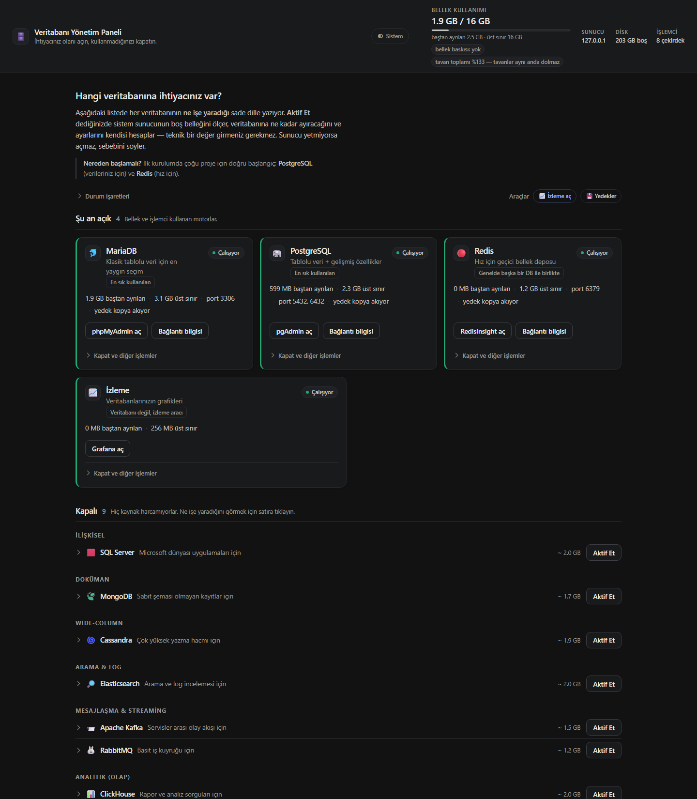
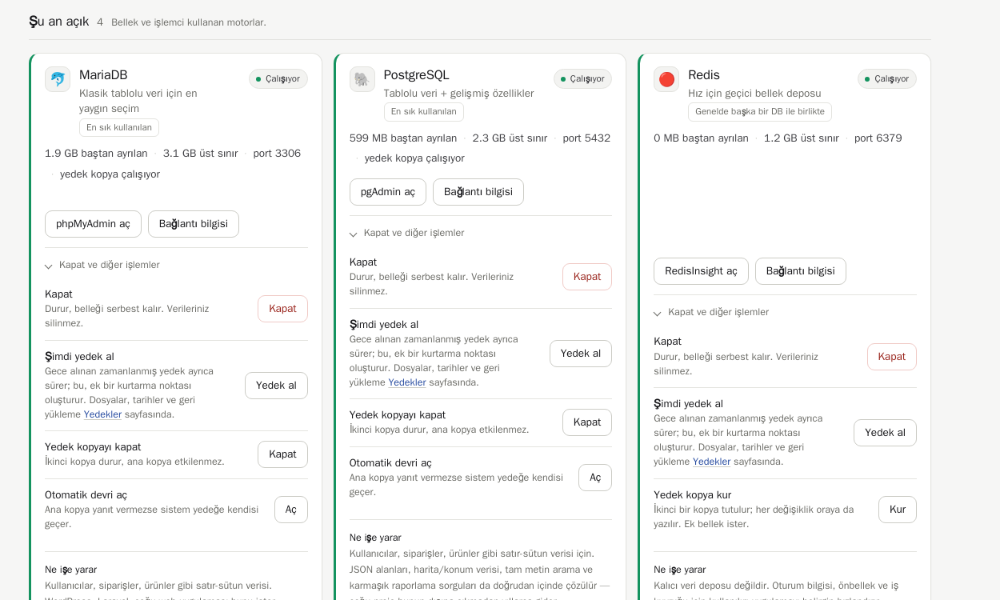
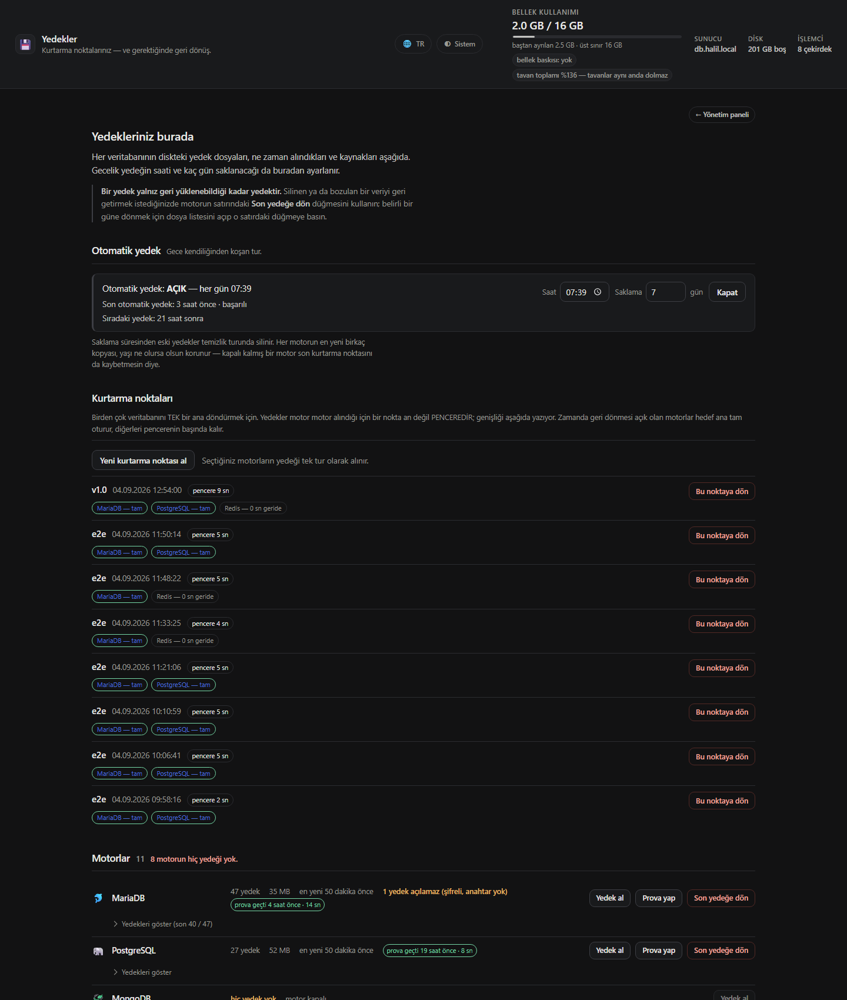
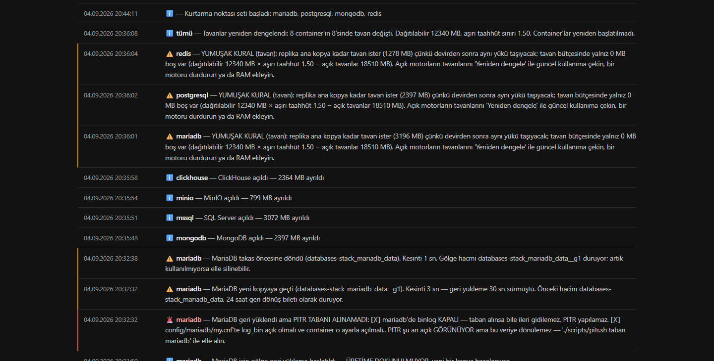
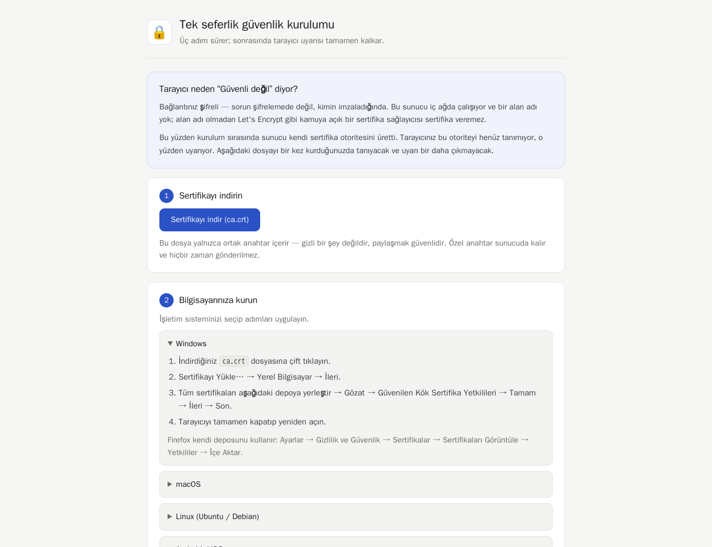

<div align="center">

# 🗄️ databases-stack

***Türkçe** · [English](README.md)*

### *Tek sunucuda 12 veritabanı — istediğini aç, istemediğini kapat*

**Panelden düğmeye bas, veritabanın açılsın.** Sistem sunucunun belleğini ölçer,
o veritabanına ne kadar ayıracağını ve iç ayarlarını kendisi hesaplar.
Sen hiçbir teknik değer girmezsin.

**Ana kopya çökerse yedeğe kendisi geçer** — uygulamanın bağlantı adresi değişmeden.

[](https://docs.docker.com/compose/)
[](docs/KUBERNETES.tr.md)
[](LICENSE)

</div>

---

## Nasıl görünüyor?

<div align="center">

</div>

Sayfa iki bölgeden oluşur. Üstte **şu an açık** olanlar kart hâlinde: ne kadar
bellek aldıkları, hangi porttan bağlanılacağı, yedek kopyası ve otomatik devri
var mı. Altta **kapalı** olanlar tek satır — hiç kaynak harcamıyorlar, bir
kartı hak etmiyorlar. Satıra tıklayınca ne işe yaradığı, tahmini belleği ve
lisansı açılır.

Üst bardaki birincil sayı **gerçek kullanımdır**, altındaki satırda ise iki
ayrı büyüklük durur: *baştan ayrılan* (motorun açılışta gerçekten aldığı
bellek) ve *üst sınır* (docker limiti). İkisini ayırmak şart, çünkü docker
limiti bir **tavandır, rezervasyon değil** — tavanları toplayıp RAM ile
kıyaslamak, yoldaki arabaların azami hızlarını toplayıp "yol kapasitesi aşıldı"
demeye benzer. Ölçülen bir örnek: 16 GB'lık sunucuda tavan toplamı 14 GB
görünürken gerçek kullanım 2 GB, çekirdeğin bellek baskısı ise sıfırdı.
Ayrıntı: [Bellek otomatik hesaplanır](#bellek-otomatik-hesaplan%C4%B1r).

<div align="center">

</div>

Gündelik işler kartın yüzünde (paneli aç, bağlantı bilgisi). **Geri dönüşü zor
olanlar** — kapatmak, yedek kopyayı kaldırmak, otomatik devri kapatmak —
kapalı bir bölümde ve her biri **ne olacağını tek cümleyle** söylüyor. Yan yana
duran altı düğme arasından yanlışına basmak bu üründe mümkün değil.

<div align="center">

</div>

Yedekler kendi sayfasında (**Araçlar → Yedekler**): gecelik turun saati ve kaç
gün saklanacağı, her motorun kaç yedeği olduğu, en yenisinin ne zaman alındığı
ve her dosyanın **kaynağı** — `elle`, `zamanlı` ya da `dış` (komut satırı).
Kurtarma da buradan: **Son yedeğe dön** ya da dosya listesinden belirli bir
güne. Geri yükleme veriyi silip yerine koyduğu için onay penceresi motor adını
yazdırır — tek tıkla olacak bir iş değil.

Her motorun satırında bir de **prova rozeti** var: `prova geçti 17 dakika önce
· 10 sn`. Bu, o yedeğin tek kullanımlık bir container'da gerçekten geri
yüklendiği ve kaç saniye sürdüğü demek — vaat değil ölçüm. Provayı panelden,
haftalık zamanlayıcıdan ya da komut satırından çalıştırmanız fark etmez:
sonuç aynı deftere, **kaynağı yazılı** olarak düşer.

<div align="center">

</div>

İzleme ayrı bir kurulum değil, panelden açılan bir modül: **İzleme aç** deyince
Prometheus + Grafana kalkar, açık olan her motorun exporter'ı hedef listesine
kendiliğinden eklenir ve **11 hazır pano** gelir — hepsi Türkçe ve "her şey
yolunda mı?" sorusuna cevap verecek şekilde yazılmış. Tek bir PromQL sorgusu
yazmanız gerekmez; kapattığınızda da hedef listesinden kendiliğinden çıkar.

<div align="center">

</div>

Panelin altında **ne olduğu yazıyor**: hangi motor ne zaman açıldı, ne kadar
bellek ayrıldı, hangi ayar hesaplandı, bir aktivasyon neden reddedildi, otomatik
devir ne zaman ve **hangi sebeple** çalıştı. Sunucuya girip `docker logs`
okumadan olan biteni buradan takip edersiniz.

<div align="center">

</div>

İç ağda alan adı olmadığı için TLS sertifikasını sunucu kendisi üretir.
Tarayıcının "güvenli değil" uyarısını kaldırmak için **tek seferlik** bu rehber
adım adım anlatır — sertifikayı kurduktan sonra sayfa sizi otomatik panele
geçirir. Panele bir kez girdiğinizde bütün yönetim ekranları (phpMyAdmin,
pgAdmin, Grafana…) parola sormadan açılır; dışarıdan doğrudan gelen biri ise
hâlâ parola ekranıyla karşılaşır.

---

## Kurulum

**Önkoşul:** Docker (yoksa `install.sh` size kurulum komutunu verir):

```bash
curl -fsSL https://get.docker.com | sudo sh && sudo usermod -aG docker $USER && newgrp docker
```

Sonra:

```bash
sudo mkdir -p /opt/databases && sudo chown $USER:$USER /opt/databases
git clone https://github.com/halilibrahimd27/databases-stack.git /opt/databases
cd /opt/databases && ./install.sh
```

Bu kadar. Soru sormaz. Parolaları, TLS sertifikalarını ve sunucu adresini kendisi
üretir/algılar, sonuçları ekrana ve `credentials.txt`e yazar.

Sonra tarayıcıdan `https://<sunucu-ip>/` adresine gidin ve ihtiyacınız olan
veritabanının satırındaki **Aktif Et** düğmesine basın.

> **Tarayıcı "güvenli değil" diyorsa:** `http://<sunucu-ip>/ca.crt` adresinden
> sertifikayı indirip bilgisayarınıza kurun, uyarı kalkar. Bu iç ağa özel bir
> sertifika otoritesidir — alan adı (domain) gerektirmez, internete çıkmaz.

---

## Nasıl çalışıyor?

Kurulumdan sonra **hiçbir veritabanı çalışmıyor.** Sadece üç küçük servis ayakta:
giriş kapısı (nginx), kontrol servisi ve Adminer. Toplam ~450 MB.

Panelde bir veritabanını açtığınızda arka planda şunlar olur:

```
"Aktif Et"  →  Kontrol servisi sunucuyu ölçer
                 ├─ Toplam RAM, çekirdeğin MemAvailable'ı, boş disk, CPU
                 ├─ Açık motorların REZERVESİ (açılışta gerçekten ayırdıkları)
                 ├─ Açık container'ların TAVANI (docker --memory)
                 └─ /proc/pressure/memory — çekirdek baskı altında mı?
                             ↓
               Üç kapı da geçiliyor mu?
                 ├─ HAYIR → açmaz, HANGİ kapıya takıldığını söyler
                 └─ EVET  → tavanı ve motorun iç ayarlarını hesaplar
                             (buffer pool, JVM heap, WiredTiger cache,
                              max_connections, work_mem …)
                             ↓
               docker compose --profile <motor> up -d
```

**Kapalı bir veritabanı hiç container yaratmaz** — sıfır RAM, sıfır CPU tüketir.
Kapatmak verileri silmez; diskte kalır, tekrar açtığınızda her şey yerindedir.

### Bellek otomatik hesaplanır

Belleğin iki ayrı büyüklüğü var ve bu ürünün en pahalı hatası ikisini aynı
şey sanmaktı.

| | **Rezerve** (taban) | **Tavan** (limit) |
|---|---|---|
| Ne demek? | Motorun **açılışta gerçekten ayırdığı** bellek | `docker --memory`: aşılırsa çekirdek container'ı öldürür (OOM) |
| Nereden gelir? | PostgreSQL `shared_buffers`, MariaDB `innodb_buffer_pool_size`, JVM motorlarında `-Xms` | Kontrol servisinin motora verdiği üst sınır |
| Redis · MSSQL · MinIO · ClickHouse | **~0** — boş başlarlar, tavana doğru *büyürler* | Büyüyebilecekleri son nokta |
| Toplamı | Dağıtılabilir belleği **asla** aşamaz | Dağıtılabiliri **aşabilir** (varsayılan sınır: 1,5 katı) |

**Dağıtılabilir bellek** = toplam RAM − işletim sistemi payı − çekirdek
servislerin payı.

#### Tavan toplamının RAM'i aşması normaldir

16 GB'lık bir test sunucusunda ölçülen tablo:

| Container | Tavan | Gerçek kullanım |
|---|---|---|
| mariadb | 3196 MB | 243 MB (%7) |
| mariadb-replica | 3196 MB | 213 MB (%6) |
| postgresql | 2397 MB | 98 MB (%4) |
| redis | 1278 MB | 5 MB (%0) |

Aynı makinede toplam RAM 15984 MB, tavanların toplamı 15087 MB, dağıtılabilir
bellek ise 12340 MB (15984 − 3196 işletim sistemi − 448 çekirdek servisler).
Yani tavan toplamı dağıtılabilirin **%122'si**. Buna karşılık:

- `free -m` → kullanılan **1508 MB**, available **13987 MB** (makine %91 boş),
- `/proc/pressure/memory` → `some avg10=0.00 · avg60=0.00`, `full avg10=0.00`
  (çekirdek tek bir görevi bile bellek için bekletmiyor),
- motorların **gerçekten ayırdığı** toplam: **2516 MB** — dağıtılabilirin
  %20'si.

Tavanları toplayıp RAM ile kıyaslamak, yoldaki arabaların azami hızlarını
toplayıp "yol kapasitesi aşıldı" demeye benzer. Ürün bir süre tam olarak bunu
yapıyordu: panel **"AYRILAN BELLEK 15 GB / 12 GB · %122 aşım"** yazıyor ve
kapalı motorların hepsinde "bellek yetmiyor" diyordu — boş bir makinede.

#### Bir motoru açmadan önceki üç kapı

1. **Rezerve kapısı — sert.** `Σ rezerve + yeni motorun rezervesi ≤
   dağıtılabilir`. Asla esnetilmez: rezerve, motorun ayıracağı **gerçek**
   bellektir; sığmıyorsa açmak OOM'a davetiyedir.
   Sığmayan istek önce küçültülür (daha küçük tavan → daha küçük rezerve);
   asgari tavanda bile sığmıyorsa reddedilir.
2. **Tavan kapısı — yumuşak.** `Σ tavan + yeni tavan ≤ dağıtılabilir × 1,5`.
   Tavanların hepsi aynı anda dolmaz. Katsayı kontrol servisinin
   `OVERCOMMIT_LIMIT` ortam değişkeniyle değişir; `1.0` yazmak aşırı taahhüdü
   kapatır, yani yukarıdaki eski davranışa döner.
3. **Çekirdek kemeri.** `/proc/meminfo`daki `MemAvailable` yeni rezerveyi +
   emniyet payını karşılıyor mu; `/proc/pressure/memory` baskı bildiriyor mu?
   **Defter ne derse desin çekirdeğin gerçeği bağlayıcıdır.** PSI'ı olmayan
   eski çekirdeklerde baskı kapısı atlanır — ölçemediğimiz bir şeyi gerekçe
   gösterip motor açtırmamak kullanıcıya yalan söylemek olurdu.

Reddedilen aktivasyon **hangi kapıya** takıldığını yazar; hepsine birden
"bellek yetmiyor" demez.

#### Yeniden dengeleme

Tavan toplamı politika sınırını geçtiğinde (bir motor elle büyütüldü,
sunucudan RAM eksildi, ya da `OVERCOMMIT_LIMIT` düşürüldü) kontrol servisi
bunu bildirir. **Yeniden dengeleme** — panelden ya da `POST /api/rebalance` —
açık motorların tavanlarını yeniden hesaplar ve `docker update` ile **canlı**
uygular:

- Container'lar **yeniden başlatılmaz.** Açık bağlantılar kopmaz, InnoDB
  kurtarma çalışmaz, kesinti olmaz. (Kolay yol `compose up -d` ile motoru
  yeniden yaratmak olurdu; o yol çalışan veritabanını kapatır.)
- Yalnız **tavan** değişir. Motorun açılışta ayırdığı bellek çalışırken
  küçültülemez — buffer pool'u geri veremezsiniz. Bu yüzden yeniden dengeleme
  hiçbir tavanı motorun mevcut **rezervesinin altına** indirmez; o ayar ancak
  motor yeniden başlatıldığında yeni tavana göre hesaplanır.

`./scripts/e2e/sizing.sh` bunu ölçüyor: aşırı taahhüt durumunu kendisi
yaratıyor, yeniden dengelemeyi çağırıyor, tavanın gerçekten düştüğünü
cgroup'tan okuyor ve `.State.StartedAt` ile hiçbir container'ın yeniden
başlatılmadığını doğruluyor.

Ayrıntı, formüller ve motor başına rezerve tablosu:
[docs/BELLEK.tr.md](docs/BELLEK.tr.md)

### Bunun neden önemli olduğu

Aynı hesabın somut karşılığı — boş bir sunucuda, `./stack.sh plan` çıktısı:

| Sunucu | MariaDB açılırsa | Elasticsearch açılırsa |
|---|---|---|
| 512 MB | **açılmaz** — 512 MB tavan + 320 MB panel/exporter dağıtılabilire sığmıyor | açılmaz |
| 2 GB | tavan 512 MB · rezerve (buffer pool) 307 MB | açılmaz |
| 4 GB | tavan 819 MB · rezerve 491 MB | tavan 1024 MB · rezerve (JVM heap) 512 MB |
| 16 GB | tavan 3276 MB · rezerve 1965 MB | tavan 2949 MB · rezerve 1474 MB |
| 128 GB | tavan 16 GB (tek motor sunucuyu yutmasın) · rezerve 9830 MB | tavan 16 GB · rezerve 8192 MB |

4 GB'lık makinede 16 GB'lık veritabanı açılmaya çalışılmaz; 128 GB'lık makinede
de varsayılan değerlerde kalınmaz. Kapılardan biri kapalıysa kart pasifleşir ve
**hangi kapı** olduğunu yazar. Tavan kapısına takılan bir ret, ekranda boş
belleği gördüğü için haklı olarak "ama yer var" diyen kullanıcıya şunu söyler:
*"Bu bir TAVAN sıkışmasıdır, belleğin dolu olduğu anlamına GELMEZ"* — ve o
andaki çekirdek boş bellek ölçümünü, baskı seviyesini, çözüm yollarını
(yeniden dengele / bir motoru durdur / `OVERCOMMIT_LIMIT`'i yükselt) sıralar.

Hesabı görmek için: `./stack.sh plan mongodb`

---

## İçindeki veritabanları

Hepsi kapalı gelir; yalnız kullandıklarınız açılır.

| | Veritabanı | Ne için | Panel |
|---|---|---|---|
| 🐬 | **MariaDB** | Klasik tablolu veri — kullanıcılar, siparişler, ürünler | phpMyAdmin |
| 🐘 | **PostgreSQL** | Aynı iş + JSON, konum verisi, karmaşık sorgular | pgAdmin |
| 🍃 | **MongoDB** | Sabit şeması olmayan kayıtlar | Mongo Express |
| 🔴 | **Redis** | Önbellek, oturum, kuyruk (kalıcı depo değil) | RedisInsight |
| 🟥 | **SQL Server** | .NET / Windows tabanlı kurumsal uygulamalar | Adminer |
| 🌀 | **Cassandra** | Çok yüksek yazma hacmi, lineer ölçek | cqlsh |
| 🔎 | **Elasticsearch** | Site içi arama, log analizi | Kibana |
| 📨 | **Kafka** | Servisler arası olay akışı | Kafka UI |
| 🐰 | **RabbitMQ** | Basit iş kuyruğu (Kafka'dan çok daha kolay) | Management UI |
| 📊 | **ClickHouse** | Rapor ve analiz sorguları (OLAP) | Play UI |
| 🕸️ | **Neo4j** | İlişki ağırlıklı veri, öneri motorları | Neo4j Browser |
| 🪣 | **MinIO** | Dosya/görsel depolama (S3 uyumlu) | MinIO Console |

> Ne seçeceğinizi bilmiyorsanız: **PostgreSQL** (verileriniz için) +
> **Redis** (hız için) çoğu proje için doğru başlangıçtır.

---

## Erişim

Tek giriş kapısı var; **hiçbir panelin portu doğrudan dışarı açılmaz.**
Hepsi TLS + parola arkasından geçer.

| Adres | Ne |
|---|---|
| `https://<sunucu>/` | Yönetim paneli |
| `https://<sunucu>/yedekler` | Yedekler ve geri yükleme |
| `https://<sunucu>:8081…8091` | Veritabanı panelleri (kapalıysa "pasif" sayfası) |
| `https://<sunucu>:9443/metrics/<motor>` | Prometheus metrikleri |
| `<sunucu>:3306, 5432, 27017 …` | Uygulamanızın bağlanacağı veritabanı portları |

Veritabanı portları da gateway üzerinden geçer. Bu iki şey sağlar: devirde
bağlantı adresiniz değişmez, ve container'lar host'a doğrudan port açmaz.

Bağlantı bilgisini panelden **Bağlantı bilgisi** düğmesiyle ya da
`./stack.sh conn postgresql` ile kopyalayabilirsiniz.

---

## Terminalden

Panelin yaptığı her şeyi yapar; aynı otomatik boyutlandırma çalışır.

```bash
./stack.sh list                  # motorlar, durumları, tahmini bellek
./stack.sh enable postgresql     # aç
./stack.sh plan elasticsearch    # açılsa ne kadar ayrılırdı?
./stack.sh disable redis         # kapat (veri silinmez)
./stack.sh conn mariadb          # bağlantı bilgisi
./stack.sh replica on postgresql # yedek kopya kur
./stack.sh backup                # aktif motorların hepsini yedekle
./stack.sh app-user              # uygulama için kısıtlı kullanıcı
./stack.sh doctor                # kurulum sağlık kontrolü
```

---

## Yedekleme

Panelde **kendi sayfası** var: `https://<sunucu>/yedekler`. Panelin üstündeki
**Araçlar** satırındaki *Yedekler* bağlantısından açılır; sayfanın başındaki
**← Yönetim paneli** ile geri dönersiniz. Aynı parolanın, aynı kapının
arkasındadır — panel neyse o.

Ayrı sayfa olmasının sebebi şu: yedek listesi motor başına dosya dosya
büyüyen bir liste. Yönetim panelinin altına sıkıştırıldığında, "dün gece
yedek alındı mı?" sorusunun cevabı on iki kartın altında, sayfanın
görünmeyen kısmında kalıyordu.

### Kurtarma provası — yedeğin tek dürüst güvencesi

Bir yedeğin sağlam görünmesi, geri yüklenebileceği anlamına gelmez. Bu ürün
o boşluğu kapatıyor: **prova**, yedeği tek kullanımlık bir container ve tek
kullanımlık bir hacimde **gerçekten geri yükler**, süreyi ölçer, tablo/satır
sayar ve üretimle karşılaştırır. Sonra kendini siler.

```bash
./scripts/restore-drill.sh mariadb        # en yeni yedekle prova
```

Üretime, üretim hacmine ve gateway'e dokunmaz — bu bir niyet beyanı değil,
prova container'ı `--network none` ile ve ayrı bir hacimle açılıyor.

Ölçülmüş bir koşum:

```
[✓] Geri yükleme tamamlandı — ölçülen RTO: 13 sn
    geri yüklenen kopya: 1 tablo / 1 satır
    üretim (mariadb-replica): 1 tablo / 1 satır
{"engine":"mariadb","ok":true,"seconds":13,"match":true,"cleanup":true, …}
```

Panelde *Yedekler* sayfasında motor satırında üç durumdan biri görünür:

| Rozet | Anlamı |
|---|---|
| `prova geçti 2 saat önce · 13 sn` | Bu yedek gerçekten geri yüklendi, ölçülen süre bu |
| `PROVA KALDI` | Elde **geri yüklenemeyen** bir yedek var — felaket gününden önce öğrenildi |
| `prova yapılmadı` | Yedeğiniz var ama geri yüklenip yüklenmeyeceği **bilinmiyor** |

Üçüncüsü bilerek görünür: bilmediğimiz bir şeyi sessizce boş bırakmak,
olmayan bir güvence hissettirir. Gecelik yedeğin ardından haftada bir
kendiliğinden koşar (`DRILL_EVERY_DAYS`), düşerse olay **kritik** seviyede
kaydedilir ve webhook'a düşer.

### Veri getirme — elinizdeki veriyi içeri alma

Yeni bir veritabanı açmak kolay; asıl mesele verinin zaten başka yerde
olması. `import.sh` bir dump dosyasını ya da uzaktaki canlı bir kaynağı
içeri alır — ve **yanlış şeyi yapmayı reddeder**:

```bash
./scripts/import.sh mariadb dump.sql.gz              # yerel dosya
./scripts/import.sh postgresql --kaynak postgres://…  # uzak canlı kaynak
./scripts/import.sh mariadb dump.sql.gz --kuru        # ne olacağını göster, yazma
```

| Durum | Davranış |
|---|---|
| Hedef boş değil | **Reddeder** ve ne bulduğunu söyler ("1 şema, 1 tablo, 16 KB") |
| `--uzerine-yaz` verildi | Önce **güvenlik yedeği** alır, dosya adını yazar |
| Dosya başka motorun dump'ı | **Reddeder** — biçimi tanır, doğru komutu yazar |
| Motor kapalı | **Reddeder**, nasıl açılacağını söyler |

Desteklenen biçimler: MariaDB/MySQL `.sql(.gz)`, PostgreSQL `.sql(.gz)` ve
`-Fc` arşivi, MongoDB `.archive(.gz)`, Redis `.rdb(.gz)`, SQL Server `.bak`.

### Otomatik yedek

Günlük yedek saati ve saklama süresi bu sayfadan ayarlanır; açıp kapatmak tek
düğme. Zamanlayıcı **controller'ın içinde** çalışır — host'ta root yetkisi,
cron kurulumu ya da systemd birimi gerektirmez. Son koşumun sonucu
(başarılıysa ne zaman, başarısızsa **sebebiyle birlikte**) ve sıradakinin
zamanı aynı yerde yazar.

> Bu, ölçülmüş bir arızanın sonucudur. Önceden `install.sh` yalnız
> `state/crontab` dosyasını *üretiyor* ve "yüklemek için `crontab state/crontab`"
> diyordu. Kimse yapmıyordu: test sunucusunda `crontab -l | grep backup` sıfır
> satır, `backups/` altındaki klasörler boştu. Yani yedek alındığı sanılırken
> hiç alınmıyordu — bir yedekleme sisteminin verebileceği en kötü sonuç.
> `./stack.sh doctor` artık zamanlama kapalıysa bunu açıkça söylüyor.

Saklama süresinden eski yedekler temizlik turunda silinir, ama her motorun
**en yeni birkaç kopyası yaşı ne olursa olsun korunur**: kapalı kalmış bir
motorun yedeği yenilenmediği için tarih eşiğini geçiyor ve eski sürüm onun
son kurtarma noktasını da siliyordu.

### Elle yedek

Her motor satırında **Yedek al** düğmesi var (aynısı yönetim panelindeki
kartlarda da duruyor). Elle alınan yedek gecelik turu iptal etmez, ek bir
kurtarma noktası oluşturur. Motor kapalıyken düğme tıklanmaz: döküm araçları
veritabanına bağlanır, kapalı motorda yapacakları bir şey yoktur.

Listede her dosyanın tarihi, boyutu ve **kaynağı** yazar: `elle`, `zamanlı`
ya da `dış` (host cron'u veya komut satırı). Kaynak dosya adından tahmin
edilmez — controller kendi başlattığı koşumdan sonra oluşan dosyaları
deftere yazar, deftere girmemiş dosya `dış`tır.

### Geri yükleme

**Artık panelden yapılabiliyor.** Motorun satırındaki **Son yedeğe dön**
düğmesi en yeni kopyaya döner; belirli bir güne dönmek için **Yedekleri
göster** ile dosya listesini açıp o satırdaki **Bu yedeğe dön** düğmesini
kullanırsınız. "Son yedek" her zaman istenen yedek değildir — veriyi bozan
işlem dün öğlen olmuşsa dönülecek yer ondan önceki kopyadır.

Düğme işi hemen başlatmaz. Açılan onay penceresi ne olacağını yazar —
*mevcut veriler silinir, veritabanı o dosyadaki hâline döner, o tarihten
sonra yazılan her şey kaybolur* — ve dönülecek dosyanın adını, tarihini,
yaşını, boyutunu gösterir. Devam etmek için **motorun adını elinizle
yazmanız** gerekir; **Geri Yükle** düğmesi doğru yazılana kadar kapalıdır.
Terminalde `evet` yazarak verdiğiniz onayın panel karşılığı budur: yan yana
duran düğmeler arasından yanlışına basarak yapılabilecek bir işlem değil.

Dosya, veriye dokunulmadan **önce** doğrulanır. Bozuk ya da yarım bir yedekle
başlanan geri yükleme veriyi geri getirmez, yalnızca yok eder.

Otomatik geri yükleme beş motorda vardır: **MariaDB, PostgreSQL, MongoDB,
Redis, SQL Server.** Diğerlerinin yedeği alınır ama geri dönüş motora özgü
elle bir işlemdir; hangisinde ne yapılacağı [docs/BACKUP.tr.md](docs/BACKUP.tr.md)
içinde yazıyor.

### Komut satırından

Panel ne yapıyorsa aynısı; ikisi de aynı `scripts/backup.sh`i çağırır.

```bash
./stack.sh backup                # aktif motorlar (kapalı olanlar atlanır)
./stack.sh backup mariadb        # tek motor
./scripts/backup.sh list         # yedekleri listele
./stack.sh restore mariadb backups/mariadb/full/mariadb_full_20260901.sql.gz
```

> **Cron'dan koşuyorsanız izinlere dikkat.** `state/` ve `logs/` altına iki
> ayrı kimlik yazar: controller container'ın içinde **root** olarak (docker
> soketine erişmek zorunda), siz ve cron ise sunucudaki yönetici olarak. Kim
> önce yazarsa dosya onun olur; root'un açtığı `0644/root:root` bir dosyaya
> yönetici bir daha yazamaz. Sonucu **sessizdir**: gece işleri "Kilit dosyası
> açılamadı" ile düşer, panel kendi yolundan çalışmayı sürdürdüğü için hata
> görünmez. Kurulum bunu `state/` ve `logs/`'u setgid (2775) yaparak ve
> `umask 0002` ile çözüyor. Eski bir kurulumda:
>
> ```bash
> ./stack.sh doctor            # yazamadığınız dosyaları sahibiyle listeler
> sudo ./stack.sh doctor --duzelt
> ```
>
> `doctor` dosyanın **moduna** değil, gerçekten yazılabilir olup olmadığına
> bakar — mod doğru görünüp grup üyeliği eksikken de yazamazsınız.

Host cron'unu tercih ederseniz `state/crontab` hâlâ üretiliyor; ikisi birlikte
koşarsa `backup.sh` kendi kilidiyle çakışmayı önler. Aynı kilit geri yüklemede
de tutulur — 02:00 turu, yarım geri yüklenmiş bir veritabanını "geçerli yedek"
diye döküp uzağa senkronlamasın diye.

Ayrıntı ve motor başına yöntemler: [docs/BACKUP.tr.md](docs/BACKUP.tr.md).
Uzak depo (Google Drive / S3 / SFTP): [docs/GOOGLE-DRIVE.tr.md](docs/GOOGLE-DRIVE.tr.md).

---

## Basabildiğiniz geri yükleme

Yedekleme ailesinin en zayıf halkası hep aynı yerdeydi: **geri yükleme
düğmesine kimse basmıyor.** Basmak dört şey demekti — mevcut veri yok olur,
kesinti geri yüklemenin tamamı kadar sürer, dosyanın gerçekten açılacağı
basmadan önce bilinmez ve yanlış dosya seçildiyse geri dönüş yoktur.

Bu sürümde geri yükleme **iki yönlü bir kapı**:

| | Klasik | Kesintisiz (gölge) |
|---|---|---|
| Üretim | geri yükleme boyunca **kapalı** | **çalışmaya devam eder** |
| Kesinti | geri yükleme süresi kadar | container yeniden yaratılırken |
| Ölçülen | — | geri yükleme 35 sn · **kesinti 3,6 sn** |
| Yanlış karar | geri dönüş yok | **24 saat geri dönüş bileti** |

Bedeli saklanmıyor: takasa kadar üretim bugünkü (belki bozuk) veriyi servis
etmeye devam eder ve diskte bir kopyalık fazladan yer gerekir. Yer yetmezse
işlem başlamadan **sayıyla** reddedilir.

Ayrıntı: [docs/BACKUP.tr.md](docs/BACKUP.tr.md)

## "Bu dosya hangi şemayı geri getirir?"

Kurtarma provası uzun süre yalnız tablo ve satır saydı. İndeks, kısıt, view,
trigger ve rutin kaybı bu ölçütten **sessizce geçiyordu** — yani "prova
geçti" rozeti, göremediği bir şeyi iddia ediyordu.

Artık veritabanının şekli tek bir parmak izine indiriliyor ve **yedek
alınırken** kaydediliyor; prova geri yüklenen kopyayı o kayıtla
karşılaştırıyor. Ölçülmüş kanıt: satır sayıları birebir eşitken
(`match: true`) düşürülmüş bir indeks yakalanıyor (`schema_match: false`).

Parmak izine veri girmez — bir milyon satır eklemek onu değiştirmez.

```bash
./scripts/schema.sh postgresql
```

## Motorlar arası kurtarma noktası

Bir uygulama çoğu zaman tek veritabanı kullanmaz. Yedekler motor motor ve
dakikalar arayla alındığı için "dün geceye dön" demek, elde birbirinden uzak
birkaç **an** bırakır.

Kurtarma noktası seti, seçilen motorların yedeğini tek tur olarak alır ve
**pencereyi ölçer**: setteki en eski ve en yeni dosya arasındaki fark. Geri
yüklerken zamanda geri dönmesi açık olan motorlar hedef ana **ileri sarılarak**
tam oturur, diğerleri kendi anlarına döner.

Ürün "hepsi aynı ana geldi" **demez**; *"üç motor hedef anda, iki motor 252 sn
geride"* der. Heterojen motorlarda, yazmayı durdurmadan gerçek bir anlık
görüntü alınamaz — bunu "tutarlı yedek" diye sunmak yeni bir sessiz yeşil
olurdu.

## Dün gece tam olarak ne oluyordu?

Aktif oturum geçmişi (ASH) saniyede bir örnekleniyor: o an kim neyi
bekliyordu, bekleteni kimdi. "Dün gece dondu, sabah baktım normal" sorusunun
cevabı burada.

Örneklenemeyen saniyeler **ayrıca** yazılır: ölçüm yokluğu "sistem boştu"
demek değildir. Yığının kendi işleri (yedek, prova, bakım) da aynı zaman
çizgisine düşer — bir donmanın en olası sebebi çoğu zaman ürünün kendisidir.

## Zaman noktasına dönüş (PITR)

"Dünkü yedeğe dön" çoğu zaman istenen şey değildir: veriyi bozan `UPDATE`
dün öğlen çalıştıysa, dönülecek yer **o andan bir dakika öncesidir**. Tam
yedek + o andan sonraki WAL/binlog kayıtları bunu mümkün kılar.

```bash
./scripts/pitr.sh durum                      # ne kadar geriye dönebilirim?
./scripts/pitr.sh kur postgresql             # arşivlemeyi aç
./scripts/pitr.sh taban postgresql           # taban yedeği al
./scripts/pitr.sh don mariadb "2026-09-02 15:30:00" --prova
```

### Arşivleme zamanlanmalıdır — yoksa özellik sessizce ölüdür

PostgreSQL WAL'ı `archive_command` ile **kendi** arşivler. MariaDB'de böyle
bir mekanizma yoktur: binlog arşive yalnız `pitr.sh arsivle` çalışınca düşer.
O satır olmadan `durum` yine bir pencere yazar, ama pencerenin **üst sınırı**
en son elle arşivlenen ana çakılı kalır — ve bunu öğrendiğiniz gün, kurtarmaya
muhtaç olduğunuz gündür.

`scripts/crontab.template` (dolayısıyla `install.sh`'ın ürettiği
`state/crontab`) bunu zamanlıyor:

```cron
*/15 * * * *  scripts/pitr.sh arsivle    # RPO üst sınırı: 15 dakika
0    1 * * *  scripts/pitr.sh taban      # WAL tek başına veri değildir
15   3 * * *  scripts/pitr.sh temizle    # arşiv sonsuza kadar büyümesin
```

Motor adı vermeden çağırınca PITR'li motorların hepsinde çalışır; kapalı
motor **atlanır** (çıkış 3) ve alarm üretmez — her sabah alarm veren bir
cron, bakılmayan bir crondur. Motorları crontab'a tek tek yazmamamızın
sebebi de bu: yığına üçüncü bir PITR motoru eklendiği gün sessizce arşivsiz
kalırdı.

`--prova` üretime dokunmaz: tek kullanımlık bir kopyada dener. Pencere
**tahmin edilmiyor, arşivden hesaplanıyor** — en eski kullanılabilir taban
ile arşivdeki son kayıt arası; arşivde boşluk varsa üst sınır boşluktan
öncesine çekiliyor. Aralık dışına dönme denemesi reddediliyor.

Ölçülmüş kanıt (sunucuda, gerçek MariaDB):

```
T1'de A satırı yazıldı · T2'de B satırı yazıldı · aradaki bir ana dönüldü
[GEÇTİ] A-VAR-B-YOK — 15:30:00 anına dönüldü, kopyada yalnız A var (13 sn)
```

PostgreSQL ve MariaDB destekleniyor. Diğerlerinde neden desteklenmediği
yazılı: Redis'in AOF'unda zaman damgası yok ("14:32'ye dön" ifade edilemez),
MSSQL işlem günlüğü yedeği ister, MongoDB oplog ile mümkün ama bu turda
yapılmadı. Ayrıntı: [docs/PITR.tr.md](docs/PITR.tr.md).

## Şifreli yedek

Yedekler uzak depoya (Google Drive / S3 / SFTP) gönderiliyorsa şifresiz
gitmemeli: o hesabı ele geçiren biri bütün veriyi okur. `.env`'de bir anahtar
verirseniz yedekler `openssl aes-256-cbc` + PBKDF2 (600.000 tur) ile
şifrelenir.

> **Anahtarı kaybederseniz yedekler AÇILAMAZ.** Anahtar, yedeklerden ayrı bir
> yerde saklanmalı — aynı diskte tutmak, kilidi kapının üstünde bırakmaktır.

Geriye uyumlu: şifresiz eski yedekler çalışmaya devam eder, listeleme ve
geri yükleme ikisini de tanır. Şifreleme açıkken uzak depoya şifresiz dosya
gönderilmez. `openssl enc` bütünlük etiketi (AEAD) taşımaz — gizlilik sağlar,
kurcalanmaya karşı imza sağlamaz; bu bilinerek seçildi ve
[docs/BACKUP.tr.md](docs/BACKUP.tr.md)'de yazılı.

## Devir provası

Kurtarma provasının ikizi. "Yüksek erişilebilirlik var" demek yerine
**"geçen hafta 6 saniyede devrettik ve tek satır kaybetmedik"** demek:

```bash
./scripts/failover-drill.sh mariadb --onayla
```

Gerçek bir devir yapar ve **uygulamanın gördüğü adresten** yazma yeniden
mümkün olana kadar geçen süreyi ölçer — container'ın içinden değil, gateway
portundan. Devir öncesi commit edilen kanıt satırının kaybolmadığını
doğrular. Panelden de başlatılabilir ama gövdede açık onay ister: gerçek bir
kesinti oluşur, yanlışlıkla tıklanacak bir düğme olamaz.

## Bakım — tablo şişkinliği

Sil-yaz döngüsü tabloları şişirir: PostgreSQL'de autovacuum yetişemediğinde
ölü satırlar birikir, InnoDB'de silinen satırların yeri geri verilmez. Disk
sessizce dolar.

```bash
./scripts/maintenance.sh durum               # ölç, hiçbir şey değiştirme
./scripts/maintenance.sh bakim postgresql    # güvenli: tabloyu KİLİTLEMEZ
./scripts/maintenance.sh bakim postgresql --agresif --onayla   # yeri geri verir, KİLİTLER
```

Agresif bakımın **kilit süresi tahmin ediliyor** ve tahmin kendi kendini
kalibre ediyor: her bakımdan sonra gerçekleşen hız ölçülüp kaydediliyor
(ölçülen: 47 MB/sn). Kullanıcı o sayıya bakıp kesintiyi kabul edip
etmeyeceğine karar veriyor. Panel yalnız güvenli bakımı sunar.

## Yavaş sorgu avcısı

"Veritabanım yavaş" herkesin derdi ama kimse `EXPLAIN` okumak istemiyor. Bu
araç en pahalı sorguları bulur ve mümkün olduğunda ne yapılacağını söyler:

```bash
./stack.sh sorgu kur postgresql     # ölçümü aç (yeniden başlatma gerekir, söyler)
./stack.sh oturum destek       # aktif oturum geçmişi — hangi motorlarda ölçülebiliyor
./stack.sh sema postgresql     # şema parmak izi
./stack.sh sorgu durum              # en pahalı sorgular
./stack.sh sorgu oneri postgresql   # indeks / kullanılmayan indeks önerileri
```

**Sıralama toplam süreye göre, ortalamaya göre değil** — ve bu karar ölçülerek
verildi. Gerçek koşumdan:

| sorgu | çağrı | toplam | ortalama | sıra |
|---|---|---|---|---|
| sık çağrılan | 400 | **56.7 ms** | 0.142 ms | **2** |
| nadir ama ağır | 2 | 14.2 ms | **7.1 ms** | 3 |

Ortalamaya göre sıralansaydı ikinci sorgu 50 kat üstte çıkardı; oysa sunucunun
CPU'sundan 4 kat fazlasını yiyen birincisi. Yanlış sorguyu optimize etmek,
hiçbir şey yapmamaktan pahalıdır.

Öneriler **uygulanmaz, gösterilir**: indeks eklemek yazma yolunu yavaşlatır ve
bu kararı veritabanının sahibi vermeli. Gizlilik: sorgu metinleri veri
içerebilir; PostgreSQL parametreleri zaten maskeler, MariaDB slow log ham
sorgu yazdığı için araç sabitleri maskeler ve bunu söyler.
Ayrıntı: [docs/SLOWLOG.tr.md](docs/SLOWLOG.tr.md).

## İzleme

Açtığınız veritabanlarının nasıl çalıştığını grafiklerle gösterir. Kurulum ya
da yapılandırma gerektirmez:

```bash
./stack.sh enable monitoring     # ya da panelden "İzleme" kartındaki Aktif Et
./stack.sh panel monitoring      # adresi yazar
```

Motor başına hazır panolar gelir: kaç bağlantı var, saniyede kaç işlem
düşüyor, önbellek işe yarıyor mu, yedek kopya geride mi. Her panelin altında
**ne anlama geldiği ve ne zaman endişelenmeniz gerektiği** yazar — veritabanı
yönetmeyi bilmeden de okunabilsin diye.

Genel Bakış panosu bu ürün için ayrıca önemli: yığın belleği otomatik
hesaplayıp dağıtıyor, bu panoda her container'ın *gerçekte* ne kadar
kullandığını ayrılan limitle yan yana görürsünüz — yani hesabın doğru olup
olmadığını gözünüzle doğrularsınız.

Hedef listesi elle yazılmaz: bir motoru açıp kapattığınızda liste kendiliğinden
güncellenir. Kapalı motor listede olmadığı için "erişilemiyor" uyarısı da
yağmaz — kapalı olmak arıza değildir.

Kapalıyken hiçbir container çalışmaz. Açıkken ~830 MB RAM ister; sunucuda yer
yoksa diğer motorlar gibi **açılmaz ve sebebini söyler**.

Ayrıntı: [docs/MONITORING.tr.md](docs/MONITORING.tr.md).

---

## Yedek kopya (master-slave)

Panelde ilgili kartın altındaki **Replika kur** düğmesi, ya da:

```bash
./stack.sh replica on postgresql
```

| Motor | Yöntem | Kesinti |
|---|---|---|
| PostgreSQL | streaming replication (`pg_basebackup`) | yok |
| MariaDB | GTID tabanlı asenkron replikasyon | yok |
| Redis | `replicaof` | yok |
| MongoDB | replica set (rs0) | **var** — primary yeniden başlar |
| Cassandra / Kafka / Elasticsearch | motorun kendi kümeleme mantığı | — |

Ayrıntı: [docs/REPLICATION.tr.md](docs/REPLICATION.tr.md)

---

## Otomatik devir (failover)

Yedek kopyayı kurduktan sonra tek bir düğme daha:

```bash
./stack.sh failover on postgresql
```

Sistem ana kopyayı 10 saniyede bir yoklar. Üst üste 3 kez yanıt alamazsa:

1. **Eski ana kopyayı durdurur** — iki kopyanın aynı anda yazı kabul edip
   verilerin ayrışmasını (split-brain) önlemek için zorunlu adım
2. **Yedeği ana kopya yapar** (yazmaya açar)
3. **Yönlendirmeyi günceller** — uygulamanız aynı adrese bağlanmaya devam eder
4. **Olayı kaydeder** ve tanımlıysa webhook bildirimi gönderir

Bunun çalışabilmesi için tüm veritabanı portları gateway üzerinden geçer:

```
uygulama → gateway:5432 → (o an ana kopya olan neyse)
```

Uygulamanız doğrudan container'a bağlansaydı, devirden sonra ölü sunucuya
bağlanmaya devam ederdi — yani devir otomatik olmazdı.

```bash
./stack.sh failover status        # durum ve devir geçmişi
./stack.sh failover now <motor>   # elle devir (bakım/test)
./stack.sh failover rebuild <m>   # eski kopyayı yedek olarak geri al
./stack.sh events                 # olay akışı
```

| Motor | Devir yöntemi |
|---|---|
| PostgreSQL | `pg_ctl promote` |
| MariaDB | relay log boşaltılır → `RESET SLAVE ALL` → yazmaya açılır |
| Redis | `REPLICAOF NO ONE` |
| MongoDB | replica set kendi seçimini yapar (arbiter ile 3 oy) |

Ayrıntı, test yöntemi ve sınırlar: [docs/FAILOVER.tr.md](docs/FAILOVER.tr.md)

---

## Kubernetes

Aynı ürün, aynı mantık: **"aktif et" = StatefulSet'i 0'dan 1 replikaya
ölçeklemek.** Manifestler katalogdan üretilir, elle yazılmaz.

```bash
python3 scripts/gen-k8s.py --with-secrets
kubectl apply -k k8s/base
```

Kontrol servisinin K8s'teki tek yetkisi StatefulSet'leri okumak ve
ölçeklemek/boyutlandırmaktır — Docker kurulumundaki docker soketi erişiminden
(host'ta tam yetki) belirgin şekilde dardır.

Ayrıntı: [docs/KUBERNETES.tr.md](docs/KUBERNETES.tr.md)

---

## Yapı

```
databases-stack/
├── install.sh              Tek komutluk kurulum
├── stack.sh                Günlük kullanım CLI'ı
├── catalog.json            ⭐ Motor kataloğu — TEK YETKİ KAYNAĞI
├── docker-compose.yml      Tüm motorlar, profil tabanlı
├── controller/             Kontrol düzlemi (aktivasyon + boyutlandırma)
├── gateway/                nginx: TLS, auth, reverse proxy, dashboard
├── config/                 Motor konfigürasyonları (my.cnf vb.)
├── scripts/                backup, sync, kullanıcı, sertifika, replikasyon, devir
├── overrides/              Duruma göre yüklenen compose parçaları
├── k8s/                    Üretilmiş Kubernetes manifestleri
└── docs/                   Ayrıntılı belgeler
```

**Yeni bir veritabanı eklemek** = `catalog.json`a bir kayıt + `docker-compose.yml`e
aynı profile sahip servisler. `./scripts/check-catalog.sh` ikisinin ayrışmadığını
doğrular; `./stack.sh doctor` bunu otomatik çağırır.

---

## Güvenlik

- Panel portları host'a açılmaz; tek giriş kapısı TLS + basic auth arkasındadır
- Her motorun **ayrı** parolası vardır (tek sızıntı 12 motoru açmaz)
- Kontrol servisinin portu yoktur; yalnız gateway'den, paylaşılan token ile erişilir
- Parolalar hiçbir betikte komut satırına yazılmaz (`ps` çıktısında görünmez)
- `./stack.sh app-user` ile uygulamanız için `DROP` yetkisi olmayan kullanıcı

> ⚠️ Bu ürün **iç ağ / VPN arkası** kullanım için tasarlandı. Veritabanı
> portlarını internete açmayın.

Ayrıntı ve sertleştirme adımları: [docs/SECURITY.tr.md](docs/SECURITY.tr.md)

---

## Nasıl doğrulanıyor

Bu ürünün iddiaları ölçülüyor. Depoda iki katman var:

```bash
./stack.sh selftest    # docker gerektirmez — boyutlandırma, API, nginx, betikler
./stack.sh e2e         # ÇALIŞAN kuruluma karşı — on dokuz paket
./stack.sh e2e --hepsi # Kubernetes dahil
```

`selftest` docker'ı taklit eder; hızlıdır ve mantık hatalarını yakalar. Ama
taklit edilen bir docker, gerçek bir container'ın yapmadığını yapmaz. Bu
yüzden ikinci katman var ve **çalışan sisteme** soruyor: veri yazılıp geri
okunuyor mu, ana kopya öldürülünce uygulama **aynı adrese** yazmaya devam
ediyor mu, alınan yedek gerçekten geri yükleniyor mu, her panonun her sorgusu
veri döndürüyor mu.

| Paket | Ne kanıtlar |
|---|---|
| `security` | Panel/API/metrik parolası, tek oturum, çapraz-site koruması |
| `sizing` | Hesaplanan limit gerçekten uygulanmış mı, bütçe dolunca reddediyor mu |
| `replication` | Replika akıyor, salt-okunur, kapatınca kalıntı bırakmıyor |
| `failover` | Ölüm → devir → **aynı adresten yazma** → veri kaybı yok |
| `backup` | Yedek al → **veriyi sil** → geri yükle → veri geri geldi |
| `monitoring` | Hedefler, metrikler, **her panonun her sorgusu** |
| `shadow` | Kesintisiz geri yükleme: kesinti **gateway portundan** ölçülüyor, bilet geri döndürüyor |
| `schema` | Şema parmak izi: aynı şema aynı hash, veri değişimi etkilemez, DDL fark edilir |
| `recovery-set` | Kurtarma noktası: pencere ölçülüyor, geri yükleme o ana döndürüyor |
| `ash` | Aktif oturum geçmişi: örnekleniyor, bekleyen/bekleten ayırt ediliyor |
| `lifecycle` | Aç/kapat/aç — kapatınca veri silinmiyor |
| `k8s` | Ayarlar pod içinde uygulanıyor mu (k3s açar ve sonunda kapatır) |

**Sonuç türü üç değil dört:**

| | Anlamı | Çıkış koduna etkisi |
|---|---|---|
| `GEÇTİ` / `BAŞARISIZ` | Ölçtük | — / 1 |
| `ATLANDI` | Ön koşul yok (motor kapalı) — meşru | yok |
| `ÖLÇÜLEMEDİ` | Sorgu düştü, docker cevap vermedi | **1** |

Son satır kasıtlı: *"bilmeyi başaramadık" ile "iyi durumda" aynı şey değildir.*
Aynı sebeple **hiçbir kontrol çalışmadıysa çıkış 2**, ölçülenden çok atlama
varsa **çıkış 3** — "0/0 geçti" diyerek yeşil görünen bir test, hiç olmayan
testten kötüdür.

Bu paket yazıldığı gün ürünün kendisinde altı gerçek hata buldu; dördü ancak
sıfırdan kurulmuş, gerçekten çalışan bir sistemde görülebilirdi. Her biri için
teste kalıcı bir koruma eklendi ve **korumanın bozuk hâli gerçekten yakaladığı**
ayrıca sınandı.

---

## Kapsam — dürüstçe

Otomatik devir **süreç düzeyindeki** arızaları karşılar: veritabanının çökmesi,
kilitlenmesi, OOM ile öldürülmesi, veri dosyasının bozulması. Bunlar pratikte
en sık yaşanan arızalardır ve sistem bunları ~30 saniyede kendisi kapatır.

Aynı ürün, ikinci bir makine eklendiğinde **host arızasını** da karşılar:
yedek kopyayı uzak bir Docker host'unda ya da Kubernetes'te node
anti-affinity ile çalıştırın (bkz. [docs/FAILOVER.tr.md](docs/FAILOVER.tr.md)).
Tek makinede çalıştırdığınız sürece, makinenin tamamı düşerse iki kopya da
düşer — bu bir eksiklik değil, tek makine olmanın tanımıdır.

Bilmeniz gerekenler:

- **Replikasyon asenkrondur.** Devirde, ana kopyanın göndermeye yetişemediği
  son işlemler kaybolabilir (tipik olarak milisaniyeler). Sıfır kayıp için
  senkron replikasyon nasıl açılır: [docs/FAILOVER.tr.md](docs/FAILOVER.tr.md)
- **Devir yedeğin yerini tutmaz.** Yanlışlıkla silinen veri replikaya da
  anında yansır. Düzenli yedek şart → [docs/BACKUP.tr.md](docs/BACKUP.tr.md)
- Veritabanı portları gateway üzerinden geçtiği için motorlar istemcinin
  gerçek IP'sini değil gateway'in IP'sini görür — host tabanlı yetkilendirme
  (`user@'192.168.1.5'`) kullanıyorsanız buna göre ayarlayın.
- Neo4j Community'de çevrimiçi yedek yoktur — yedek almak veritabanını durdurur.
- Kafka yedeklenmez (log'dur, veritabanı değil); `replication.factor` kullanın.
- MongoDB replica set açmak ana kopyayı yeniden başlatır (kısa kesinti).

---

## Lisanslar

Bu proje MIT'tir ve motorları **yeniden dağıtmaz** — resmi kayıt defterlerinden
çeker. Yani her motorun lisansı doğrudan sizinle motorun sahibi arasındadır.
Panelde her kartın altında lisans görünür, kısıtlı olanlarda aktivasyon
onayında uyarı çıkar.

```bash
./stack.sh licenses
```

Çoğu motor iç kullanımda sorunsuzdur. İki başlık dikkat ister:

- **SQL Server** varsayılan olarak **ücretsiz Express** sürümüyle gelir ve
  üretimde de kullanılabilir; sınırı veritabanı başına 10 GB ve ~1.4 GB tampon
  havuzudur. Tüm özellikler gerekiyorsa `MSSQL_PID=Developer` ücretsizdir ama
  **yalnız geliştirme/test** içindir; üretimde Standard/Enterprise lisansı ister.
- **MongoDB (SSPL), Elasticsearch (ELv2/SSPL), Redis, Neo4j, MinIO (AGPL)**
  copyleft lisanslıdır. Kendi uygulamanız için kullanmak serbesttir; bu
  motorları üçüncü taraflara **yönetilen servis olarak satarsanız** kaynak açma
  yükümlülüğü doğabilir.

İzleme modülü için: **Prometheus ve node-exporter Apache-2.0**
(kısıtsız), **Grafana OSS ise AGPL-3.0**'dır. Grafana'yı olduğu gibi
çalıştırmak serbesttir; AGPL yükümlülüğü ancak Grafana'yı DEĞİŞTİRİP ağ
üzerinden üçüncü taraflara sunarsanız doğar. İç ağda kendi panolarınızı
kullanmak bu kapsama girmez.

Copyleft istemiyorsanız imajlar değiştirilebilir — Redis yerine BSD-3 lisanslı
**Valkey** birebir geçer:

```bash
REDIS_IMAGE=valkey/valkey:8-alpine    # .env
```

Aynı mekanizma kapalı ağda kendi registry aynanız için de kullanılır.
Ayrıntı: [docs/LICENSING.tr.md](docs/LICENSING.tr.md)

---

## Lisans

MIT — [LICENSE](LICENSE)
